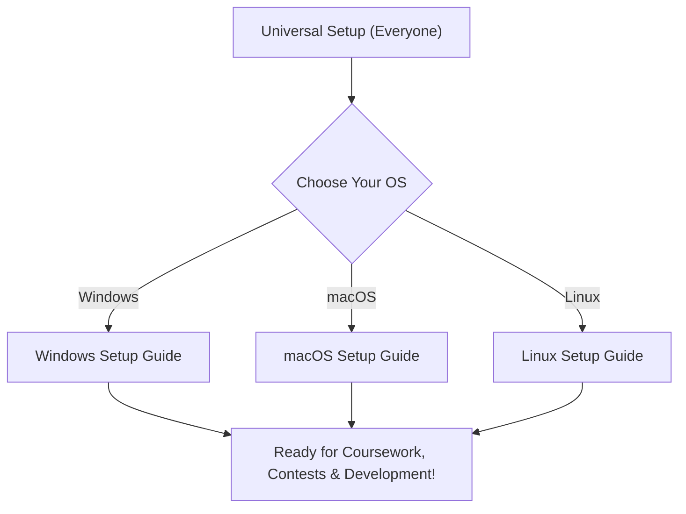

# Freshers & Juniors Developer Setup Guide

Welcome to college! This comprehensive guide will walk you through configuring your laptop or desktop for programming, coursework, competitive programming (CP), web development, machine learning, and cybersecurity from scratch.

Modern development requires a clean, robust, and reproducible setup. This repository provides a modular, step-by-step roadmap tailored specifically to your operating system.

---

## 🗺️ How to Use This Guide

Follow the guide in this recommended order:



1. **Start with [Universal Setup](./universal/README.md)**: Everyone must complete these steps first. They are handled in your web browser and editor and are identical across all operating systems:
   - Developer accounts (GitHub, Codeforces, CodeChef, Kaggle, Hugging Face)
   - Browser extensions for contests and web development
   - Visual Studio Code extensions and settings
2. **Select your Operating System**:
   - 🪟 **[Windows Setup Guide](./windows/README.md)**: Package management with Chocolatey & Winget, `uv`, `nvm-windows`, MinGW C/C++ compilers, Git & SSH, Java 21, WSL2 (Ubuntu), and Infosec tools.
   - 🐧 **[Linux Setup Guide](./linux/README.md)**: Native development environments for Ubuntu/Debian (`apt`), Arch (`pacman`), and Fedora (`dnf`), GCC/G++, `uv`, `nvm`, Java, Docker Engine, and security toolchains.
   - 🍎 **[macOS Setup Guide](./macos/README.md)**: Homebrew configuration for Apple Silicon / Intel, genuine GNU GCC (`<bits/stdc++.h>` fix), `uv`, `nvm`, Java, and Linux container setups for infosec tooling.
3. **Verify Everything**: Run through the **[Verification Checklist](./checklist.md)** or run our automated one-liner verification script directly from GitHub (Windows: `irm https://raw.githubusercontent.com/DistantMyth/axios-installation-guide/main/verify.ps1 | iex`, macOS/Linux: `curl -fsSL https://raw.githubusercontent.com/DistantMyth/axios-installation-guide/main/verify.sh | bash`) to ensure all compilers, runtimes, and SSH keys are 100% operational.

---

## 📂 Repository Structure

```text
Docs/
├── README.md                          # Main landing page & navigation hub
├── images/                            # Screenshots & setup walkthrough images
│
├── universal/                         # Platform-agnostic tools & accounts
│   ├── README.md                      # Universal overview & sequence
│   ├── 01-accounts-setup.md           # GitHub, Codeforces, CodeChef, Kaggle, Hugging Face
│   ├── 02-browser-extensions.md       # Competitive Companion, Carrot, JSON Viewer
│   └── 03-vscode-setup.md             # VS Code extensions & key configuration
│
├── windows/                           # Windows 10/11 developer configuration
│   ├── README.md                      # Windows roadmap & verification checklist
│   ├── 01-chocolatey-setup.md         # Package manager installation
│   ├── 02-packages-installation.md    # Core developer packages via Chocolatey
│   ├── 03-uv-setup.md                 # Python package manager (via Winget)
│   ├── 04-nvm-setup.md                # Node Version Manager & Node.js LTS
│   ├── 05-compilers-and-path.md       # MinGW (gcc/g++), PATH, and App Aliases fix
│   ├── 06-git-setup.md                # Git configuration & SSH authentication
│   ├── 07-java-setup.md               # OpenJDK 21, JAVA_HOME, and compiler test
│   ├── 08-wsl-setup.md                # WSL2 (Ubuntu Linux) & VS Code integration
│   └── 09-infosec-tools-setup.md      # Infosec tools in WSL & native tools
│
├── linux/                             # Linux distributions (Debian/Ubuntu, Arch, Fedora)
│   ├── README.md                      # Linux roadmap & distribution matrix
│   ├── 01-package-managers.md         # apt, pacman, dnf & repository setup
│   ├── 02-packages-installation.md    # Build essentials, git, vscode, curl, 7-zip
│   ├── 03-uv-setup.md                 # uv installation & PEP 668 environment handling
│   ├── 04-nvm-setup.md                # Node Version Manager & Node.js LTS
│   ├── 05-compilers-and-path.md       # GCC, G++, GDB, shell configuration & PATH
│   ├── 06-git-setup.md                # Git configuration & SSH key authentication
│   ├── 07-java-setup.md               # OpenJDK 21 installation & JAVA_HOME
│   ├── 08-linux-container-setup.md    # Docker CE engine & non-root user setup
│   └── 09-infosec-tools-setup.md      # Nmap, Wireshark, Burp Suite, John, etc.
│
└── macos/                             # macOS (Apple Silicon & Intel)
    ├── README.md                      # macOS roadmap & prerequisites
    ├── 01-homebrew-setup.md           # Homebrew package manager & PATH setup
    ├── 02-packages-installation.md    # Core command-line tools & VS Code cask
    ├── 03-compilers-setup.md          # Real GNU GCC vs Apple Clang (<bits/stdc++.h> fix)
    ├── 04-uv-setup.md                 # uv Python project manager
    ├── 05-nvm-setup.md                # Node Version Manager & Node.js LTS
    ├── 06-git-setup.md                # Git configuration & SSH key authentication
    ├── 07-java-setup.md               # OpenJDK 21 / Temurin & JAVA_HOME
    ├── 08-linux-container-setup.md    # Docker / Colima / OrbStack container runtime
    └── 09-infosec-tools-setup.md      # Containerized Linux environment for security tools
```

---

## ⚡ What You Will Have Set Up

By completing these guides, your machine will have:

- **Version Control**: Git configured with secure Ed25519 SSH keys linked to your GitHub profile.
- **C / C++ Compilers**: MinGW GCC on Windows, GNU GCC on macOS (supporting `<bits/stdc++.h>`), and `build-essential` on Linux.
- **Python Ecosystem**: Modern `uv` package manager (10x-100x faster than traditional `pip`) avoiding system-managed package errors.
- **JavaScript / Web Development**: `nvm` (Node Version Manager) managing Node.js LTS seamlessly without permission issues.
- **Java**: OpenJDK 21 LTS with properly configured `JAVA_HOME` and command-line compilers (`javac`, `java`).
- **Containers / Linux Environment**: WSL2 on Windows, native Docker Engine on Linux, and Docker/Colima on macOS.
- **Security / Infosec**: Core network analysis and penetration testing utilities (Nmap, Wireshark, Burp Suite) running natively or in isolated Linux containers.
- **Productivity & Contests**: VS Code loaded with CPH, Code Runner, Python, Prettier, and browser test-case parsers for Codeforces & CodeChef.

> [!TIP]
> Ready to begin? Head to the **[Universal Setup Guide](./universal/README.md)**!
