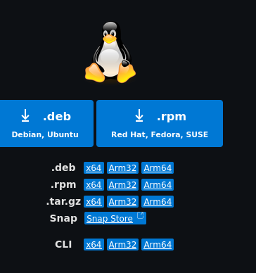
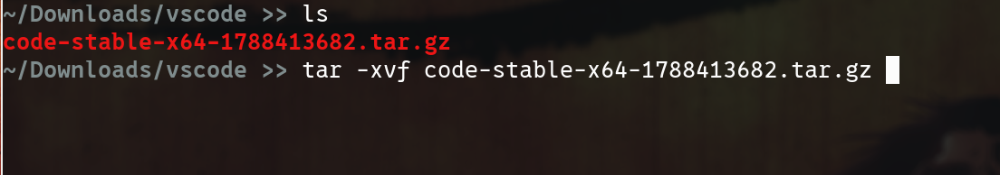
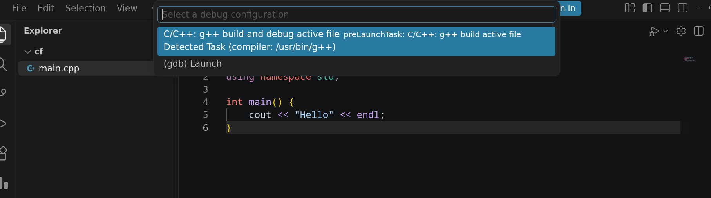

# 4. Linux Setup Guide

Linux is the developer standard in industry and academia. There are dozens of Linux distributions, but almost all of them belong to one of three major **base families**.

---

## 📑 Table of Contents

- [4.1 Popular Linux Distros and Their Base Families](#41-popular-linux-distros-and-their-base-families)
- [4.2 Installation by Distro Base](#42-installation-by-distro-base)
  - [Option A: Debian / Ubuntu-based (`apt`)](#option-a-debian--ubuntu-based-apt)
  - [Option B: Arch Linux-based (`pacman`)](#option-b-arch-linux-based-pacman)
  - [Option C: Fedora / Red Hat-based (`dnf`)](#option-c-fedora--red-hat-based-dnf)
  - [Option D: Universal Standalone Tarball (`.tar.gz`)](#option-d-universal-standalone-tarball-targz)
- [4.3 Running Your First C++ File in VS Code](#43-running-your-first-c-file-in-vs-code)
  - [Step 1: Open Your Working Directory](#step-1-open-your-working-directory)
  - [Step 2: Create a C++ Source File](#step-2-create-a-c-source-file)
  - [Step 3: Write and Run Your Code](#step-3-write-and-run-your-code)
  - [Step 4: Select the g++ Build Configuration](#step-4-select-the-g-build-configuration)
- [4.4 Using Competitive Companion & CPH in VS Code](#44-using-competitive-companion--cph-in-vs-code)
- [4.5 Verifying Advanced CP Features (PBDS & Optimization Pragmas)](#45-verifying-advanced-cp-features-pbds--optimization-pragmas)
- [4.6 Environment Variables & PATH on Linux](#46-environment-variables--path-on-linux)
  - [How Environment Variables Work](#how-environment-variables-work)
  - [Verify All Tools on Linux](#verify-all-tools-on-linux)
- [4.7 Git Setup & Authentication (Linux)](#47-git-setup--authentication-linux)
  - [Step 1: Set your Git Name and Email](#step-1-set-your-git-name-and-email)
  - [Step 2: Authenticate with GitHub via SSH](#step-2-authenticate-with-github-via-ssh)
- [4.8 Web3 & Solana Development Setup](#48-web3--solana-development-setup)
- [Next Steps](#next-steps)

---

## 4.1 Popular Linux Distros and Their Base Families

Find your distribution in the table below to know which package manager section to follow:

| Base Family | Package Manager | Popular Distributions Based on It |
| :--- | :--- | :--- |
| **Debian / Ubuntu** | `apt` | Ubuntu, Linux Mint, Pop!_OS, Debian, Kali Linux, Zorin OS, Elementary OS |
| **Arch Linux** | `pacman` | Arch Linux, Manjaro, EndeavourOS, Garuda Linux, ArcoLinux |
| **Fedora / Red Hat** | `dnf` | Fedora Workstation, Red Hat Enterprise Linux (RHEL), AlmaLinux, Rocky Linux, CentOS Stream |

---

## 4.2 Installation by Distro Base

Open your terminal (`Ctrl + Alt + T` on most distros) and run the commands for your family.

---

### Option A: Debian / Ubuntu-based (`apt`)
*(Ubuntu, Linux Mint, Pop!_OS, Debian, Kali, Zorin)*

1. Update package lists:
   ```bash
   sudo apt update && sudo apt upgrade -y
   ```

2. Install compilers, build essentials, and debugger:
   ```bash
   sudo apt install -y build-essential gdb
   ```
   *(This installs `gcc`, `g++`, `make`, and standard C/C++ libraries).*

3. Install Git, Python, Curl, Wget, and 7-Zip:
   ```bash
   sudo apt install -y git python3 python3-pip python3-venv curl wget p7zip-full
   ```

4. Install uv (modern, blazing-fast Python package & project manager):
   ```bash
   curl -LsSf https://astral.sh/uv/install.sh | sh
   ```
   *(uv installs to `~/.local/bin/uv` which is covered in the PATH section below).*

5. Install Node.js and npm:
   ```bash
   sudo apt install -y nodejs npm
   ```
   *(Or install the latest LTS version using NodeSource).*

6. Install Visual Studio Code:
   ```bash
   sudo snap install --classic code
   ```
   *Alternative without snap:* Download the official `.deb` package from [code.visualstudio.com](https://code.visualstudio.com/) and run `sudo dpkg -i <filename>.deb`.

---

### Option B: Arch Linux-based (`pacman`)
*(Arch, Manjaro, EndeavourOS, Garuda)*

1. Update system databases:
   ```bash
   sudo pacman -Syu
   ```

2. Install compilers, development tools, and debugger:
   ```bash
   sudo pacman -S --needed base-devel gdb
   ```

3. Install Git, Python, uv, Curl, Wget, and 7-Zip:
   ```bash
   sudo pacman -S git python python-pip uv curl wget p7zip
   ```

4. Install Node.js and npm:
   ```bash
   sudo pacman -S nodejs npm
   ```

5. Install Visual Studio Code:
   ```bash
   sudo pacman -S code
   ```
   *(Or `visual-studio-code-bin` via your AUR helper like `yay -S visual-studio-code-bin` for official Microsoft branding).*

---

### Option C: Fedora / Red Hat-based (`dnf`)
*(Fedora, RHEL, AlmaLinux, Rocky Linux)*

1. Update your system:
   ```bash
   sudo dnf upgrade -y
   ```

2. Install development tools and C/C++ compilers:
   ```bash
   sudo dnf groupinstall -y "Development Tools"
   sudo dnf install -y gcc gcc-c++ gdb
   ```

3. Install Git, Python, uv, Curl, Wget, and 7-Zip:
   ```bash
   sudo dnf install -y git python3 python3-pip uv curl wget p7zip p7zip-plugins
   ```

4. Install Node.js and npm:
   ```bash
   sudo dnf install -y nodejs npm
   ```

5. Install Visual Studio Code:
   Import the Microsoft repository and install:
   ```bash
   sudo rpm --import https://packages.microsoft.com/keys/microsoft.asc
   sudo sh -c 'echo -e "[code]\nname=Visual Studio Code\nbaseurl=https://packages.microsoft.com/yumrepos/vscode\nenabled=1\ngpgcheck=1\ngpgkey=https://packages.microsoft.com/keys/microsoft.asc" > /etc/yum.repos.d/vscode.repo'
   sudo dnf install -y code
   ```

---

### Option D: Universal Standalone Tarball (`.tar.gz`)
*(Applicable to any Linux distribution if you prefer a standalone portable setup or lack root/sudo permissions)*

1. **Download the Tarball:**
   Download the `.tar.gz` package from the official [Visual Studio Code download page](https://code.visualstudio.com/download):

   

2. **Extract the Archive:**
   Navigate to the directory where you downloaded the file and extract the tarball:
   ```bash
   tar -xvf code-stable-x64-*.tar.gz
   ```

   

3. **Launch VS Code:**
   After extraction, launch VS Code directly from the executable inside the extracted folder:
   ```bash
   ./VSCode-linux-x64/bin/code
   ```
   *(Optional: You can move this folder to `/opt/` and create a symlink to `/usr/local/bin/code` via `sudo ln -s /opt/VSCode-linux-x64/bin/code /usr/local/bin/code` so you can launch `code` directly from any terminal or application launcher such as Rofi, Wofi, or Dmenu).*

---

## 4.3 Running Your First C++ File in VS Code

Follow the official CP Wing workflow to set up your project workspace and run your first C++ program:

### Step 1: Open Your Working Directory
Press `Ctrl + K` then `Ctrl + O` (or go to **File** -> **Open Folder...**) to open the file browser. Create or select a dedicated folder where you will write your code (e.g. `~/cp` or `~/coding`):


### Step 2: Create a C++ Source File
In the Explorer sidebar, click the **New File** icon (or press `Ctrl + N`), name the file `main.cpp`, and hit **Enter**:


### Step 3: Write and Run Your Code
Paste a basic C++ test snippet into `main.cpp`:

```cpp
#include <iostream>

using namespace std;

int main() {
    int n;
    cout << "Enter an integer: ";
    cin >> n;
    cout << "You entered: " << n << endl;
    return 0;
}
```

To run your code:
- Press **F5** (or **Fn + F5** depending on your keyboard configuration).
- Alternatively, click the **Run C/C++ File** (play button) in the top-right corner of the editor window:


> [!NOTE]
> If VS Code asks for permissions (such as *Do you trust the authors of the files in this folder?*), click **Yes, I trust the authors**.

### Step 4: Select the g++ Build Configuration
If prompted with *Select a build configuration to run and debug*, select:
`C/C++: g++ build and debug active file`



VS Code will automatically configure the build task, compile `main.cpp` using your installed `g++` compiler, and launch your program in the integrated **Terminal** tab where you can provide input and view the output.

---

## 4.4 Using Competitive Companion & CPH in VS Code

The official CP Wing workflow pairs the **Competitive Companion** browser extension with **Competitive Programming Helper (cph)** in VS Code to parse contest problems and run test cases in one click:

1. **Browser & VS Code Extension Setup:**
   Confirm you have installed **Competitive Companion** in your browser and **Competitive Programming Helper (cph)** in VS Code (see [1.7 Browser Extensions](universal.md#17-recommended-browser-extensions) and [1.8 VS Code Extensions](universal.md#18-essential-vs-code-extensions)).

2. **Parse Any Contest Problem:**
   Open any problem on Codeforces, CodeChef, or AtCoder. Click the green **`+` (Competitive Companion)** icon in your browser toolbar:

   

3. **Automatic Problem Generation:**
   Switch to your VS Code window. If prompted to select a language, select `cpp`. CPH will automatically create the source file and load all sample test cases side-by-side:

   

4. **Run and Verify Testcases:**
   Write your solution and click the **Run** button next to each testcase (or click **Run All**):

   

   - 🟩 **Passed**: Expected output matches your program's output.
   - 🟥 **Failed**: Shows an exact diff between the expected output and your program's actual output.

---

## 4.5 Verifying Advanced CP Features (PBDS & Optimization Pragmas)

In modern competitive programming, high performance and specialized data structures like **Policy-Based Data Structures (PBDS)** (`ordered_set`) are essential. Verify your compiler with this test:

Create a file named `test_pbds.cpp`:

```cpp
#include <bits/stdc++.h>
#include <ext/pb_ds/assoc_container.hpp>
#include <ext/pb_ds/tree_policy.hpp>

// Compiler optimization pragmas
#pragma GCC optimize("O3")
#pragma GCC optimize("unroll-loops")

// x86_64 target architecture optimizations
#if defined(__x86_64__) || defined(_M_X64)
#pragma GCC target("avx2,bmi,bmi2,lzcnt,popcnt")
#endif

using namespace std;
using namespace __gnu_pbds;

// Definition of ordered_set (Policy-Based Data Structure)
template <typename T>
using ordered_set = tree<T, null_type, less<T>, rb_tree_tag, tree_order_statistics_node_update>;

template <typename T>
using ordered_multiset = tree<T, null_type, less_equal<T>, rb_tree_tag, tree_order_statistics_node_update>;

int main() {
    // Fast I/O
    ios_base::sync_with_stdio(false);
    cin.tie(NULL);
    cout.tie(NULL);

    ordered_set<int> s;
    s.insert(10);
    s.insert(20);
    s.insert(30);

    // find_by_order(k): returns iterator to the k-th smallest element (0-indexed)
    cout << "Element at index 1: " << *s.find_by_order(1) << " (Expected: 20)" << endl;

    // order_of_key(k): returns count of elements strictly smaller than k
    cout << "Elements < 25: " << s.order_of_key(25) << " (Expected: 2)" << endl;

    cout << "Linux C++ compiler, PBDS, and optimization pragmas are 100% operational!" << endl;
    return 0;
}
```

Compile and run the test in your terminal:
```bash
g++ -O3 test_pbds.cpp -o test_pbds && ./test_pbds
```

Expected Output:
```text
Element at index 1: 20 (Expected: 20)
Elements < 25: 2 (Expected: 2)
Linux C++ compiler, PBDS, and optimization pragmas are 100% operational!
```

---

## 4.6 Environment Variables & PATH on Linux

On Linux, your user environment variables and search paths are stored in shell configuration files:
- If you use Bash (default on Ubuntu, Fedora, Debian): `~/.bashrc`
- If you use Zsh (default on Manjaro, Kali, macOS): `~/.zshrc`

### How Environment Variables Work:
Whenever you install tools manually or through custom scripts (like Python local packages, `uv`, or `nvm`), they might install binaries to `~/.local/bin` or custom directories.

To add any custom directory to your PATH:
1. Open `~/.bashrc` (or `~/.zshrc`) in an editor:
   ```bash
   nano ~/.bashrc
   ```
2. Scroll to the very bottom and add:
   ```bash
   export PATH="$HOME/.local/bin:$PATH"
   ```
3. Press `Ctrl + O` then `Enter` to save, and `Ctrl + X` to exit.
4. Reload the file without restarting:
   ```bash
   source ~/.bashrc
   ```

### Verify All Tools on Linux:
```bash
gcc --version
g++ --version
python3 --version
uv --version
node --version
git --version
```
All should output valid version numbers.

---

## 4.7 Git Setup & Authentication (Linux)

### Step 1: Set your Git Name and Email
```bash
git config --global user.name "Your Name"
git config --global user.email "your_email@example.com"
```

### Step 2: Authenticate with GitHub via SSH
1. Generate an SSH key:
   ```bash
   ssh-keygen -t ed25519 -C "your_email@example.com"
   ```
2. Press **Enter** to accept the default file location, and press **Enter** twice for passphrase.
3. Display and copy your public SSH key:
   ```bash
   cat ~/.ssh/id_ed25519.pub
   ```
   Select the printed text (`ssh-ed25519 AAAAC3... your_email@example.com`) and copy it (`Ctrl + Shift + C` in Linux terminal).
   *(Optional: install `xclip` via `sudo apt install xclip` or `sudo pacman -S xclip` and run `xclip -selection clipboard < ~/.ssh/id_ed25519.pub`)*.
4. Go to **GitHub** -> **Settings** -> **SSH and GPG keys** -> **New SSH key**.
5. Title: `My Linux Machine`.
6. Paste the key and click **Add SSH key**.
7. Verify in Terminal:
   ```bash
   ssh -T git@github.com
   ```
   Type `yes` when prompted. You will see:
   `Hi <username>! You've successfully authenticated, but GitHub does not provide shell access.`

## 4.8 Web3 & Solana Development Setup

If you are joining the Web3 Wing / Onchain IIITL or building decentralized applications (dApps), install the Rust and Solana development toolchains natively on Linux:

1. **Install Rust (Rustup Toolchain):**
   ```bash
   curl --proto '=https' --tlsv1.2 -sSf https://sh.rustup.rs | sh
   ```
   Press `1` and hit Enter when prompted. Reload your shell environment:
   ```bash
   source $HOME/.cargo/env
   ```
   Verify Rust compiler and package manager:
   ```bash
   rustc --version
   cargo --version
   ```

2. **Install Solana CLI:**
   ```bash
   sh -c "$(curl -sSfL https://release.anza.xyz/stable/install)"
   ```
   Add Solana CLI to your PATH:
   ```bash
   echo 'export PATH="$HOME/.local/share/solana/install/active_release/bin:$PATH"' >> ~/.bashrc
   source ~/.bashrc
   ```
   Verify and configure default cluster to devnet:
   ```bash
   solana --version
   solana config set --url devnet
   solana-keygen new
   solana address
   ```

3. **Install Anchor Version Manager (AVM) & Anchor CLI:**
   ```bash
   cargo install --git https://github.com/coral-xyz/anchor avm --locked --force
   avm install latest
   avm use latest
   ```
   Verify Anchor:
   ```bash
   anchor --version
   ```

4. **Smoke-Test Your Solana Environment:**
   ```bash
   anchor init my-first-project
   cd my-first-project
   anchor build
   ```
   If `anchor build` finishes without errors, your Linux Solana dev environment is ready!

---

## Next Steps

- Now that VS Code, build tools, and Git are installed, head over to **[1.8 Essential VS Code Extensions](universal.md#18-essential-vs-code-extensions)** to install the recommended extensions (C/C++, CPH, Code Runner, Python, Jupyter, Ruff, etc.).
- After installing extensions, proceed to the **[5. Quick Verification Checklist](checklist.md)** to verify your complete setup.
- Or return to the **[Basic Installation Overview](README.md)**.
