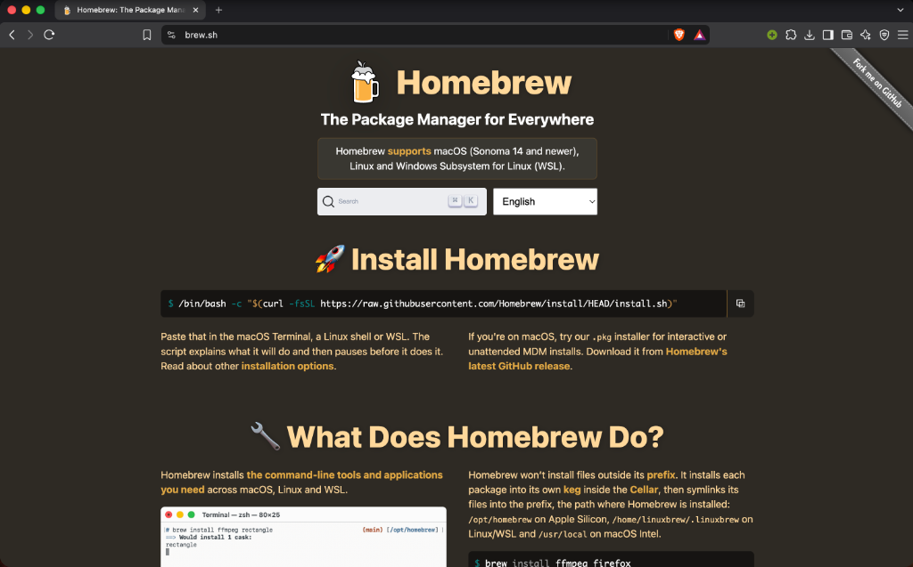
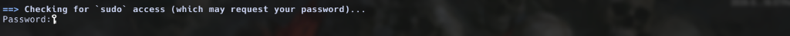
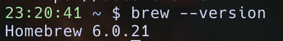
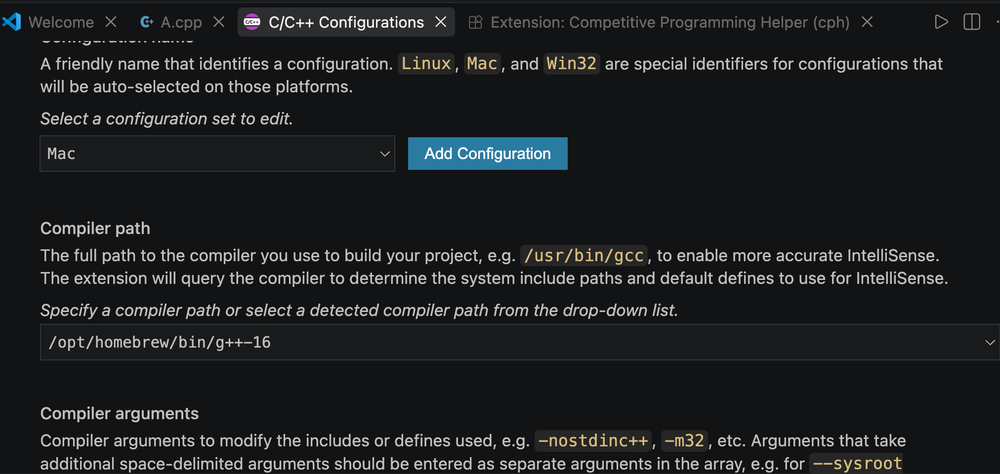
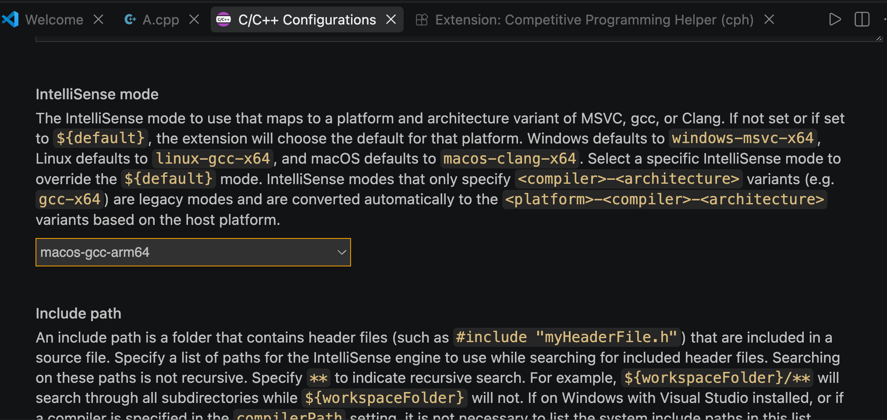
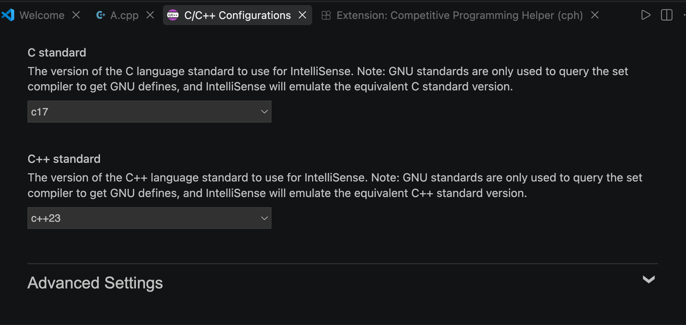
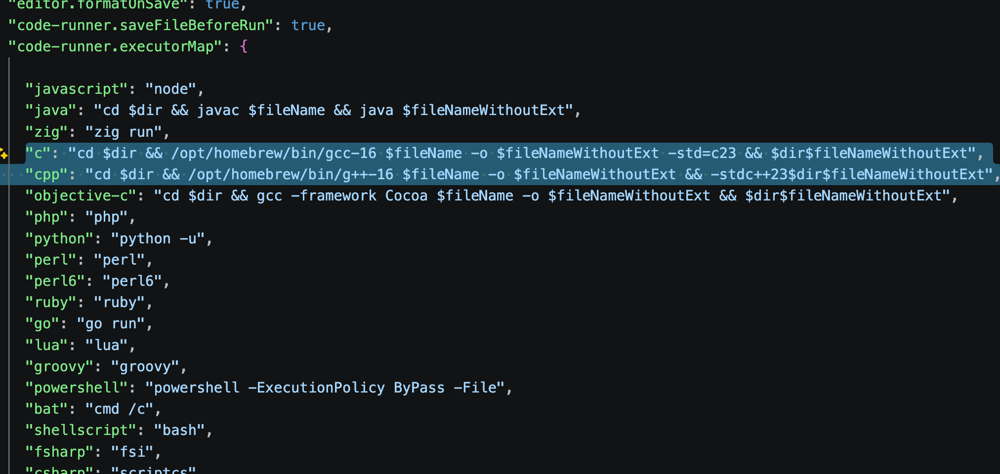
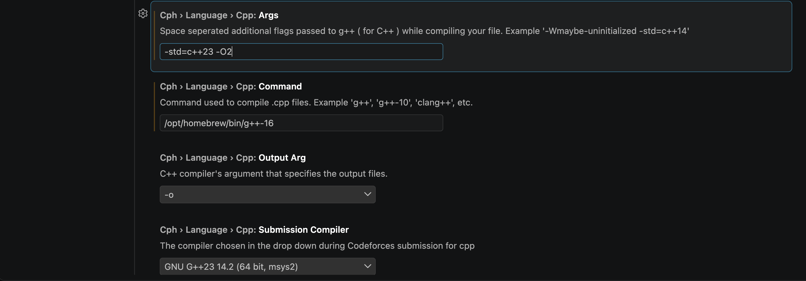
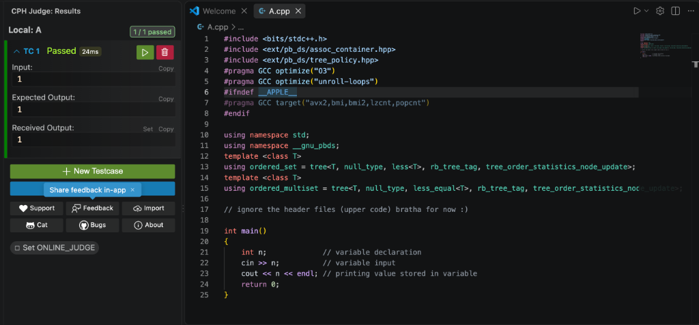

# 3. macOS Setup Guide

macOS is Unix-based and fantastic for development, but it has a few specific quirks—especially with C++ compilers and `<bits/stdc++.h>`. Follow these steps carefully.

---

## 📑 Table of Contents

- [3.1 Install Package Manager: Homebrew](#31-install-package-manager-homebrew)
- [3.2 Install Development Tools via Homebrew](#32-install-development-tools-via-homebrew)
- [3.3 Compilers: The Mac Clang vs GCC Problem & <bits/stdc++.h>](#33-compilers-the-mac-clang-vs-gcc-problem--bitsstdch)
  - [The Fix: Install Real GNU GCC via Homebrew](#the-fix-install-real-gnu-gcc-via-homebrew)
- [3.4 Configure VS Code IntelliSense for GCC & C++26](#34-configure-vs-code-intellisense-for-gcc--c26)
- [3.5 Configure Code Runner & CPH Extensions](#35-configure-code-runner--cph-extensions)
- [3.6 Terminal Aliases](#36-terminal-aliases)
- [3.7 Verify Setup with CP & PBDS Snippet](#37-verify-setup-with-cp--pbds-snippet)
- [3.8 Git Setup & Authentication (macOS)](#38-git-setup--authentication-macos)
  - [Step 1: Set your Git Name and Email](#step-1-set-your-git-name-and-email)
  - [Step 2: Authenticate with GitHub via SSH](#step-2-authenticate-with-github-via-ssh)
- [Next Steps](#next-steps)

---

## 3.1 Install Package Manager: Homebrew
Homebrew (`brew`) is the standard package manager for macOS.



1. Open **Terminal** (Press `Cmd + Space`, type `Terminal`, and press Enter).
2. Install Apple's Command Line Tools (required for build toolchains):
   ```bash
   xcode-select --install
   ```
3. Paste the official Homebrew installation command into Terminal and press Enter:
   ```bash
   /bin/bash -c "$(curl -fsSL https://raw.githubusercontent.com/Homebrew/install/HEAD/install.sh)"
   ```
4. Enter your system password when prompted.
   
   
   
   *(Note: The terminal will not display characters or asterisks while you type your password. Just type it carefully and press Enter).*
5. Press Return to confirm directory creation and proceed with the installation.
6. **Configuring Your PATH (Crucial for Apple Silicon M1/M2/M3/M4 Macs):**
   When the script finishes, locate the "Next steps" instructions and run:
   ```bash
   echo >> /Users/$USER/.zprofile
   echo 'eval "$(/opt/homebrew/bin/brew shellenv zsh)"' >> /Users/$USER/.zprofile
   eval "$(/opt/homebrew/bin/brew shellenv zsh)"
   ```
   *(For older Intel Macs, Homebrew is placed in `/usr/local/bin` and works automatically).*
7. Close and reopen Terminal, then verify:
   ```bash
   brew --version
   ```
   
   

---

## 3.2 Install Development Tools via Homebrew

Run the following command in Terminal to install all essential development tools:

```bash
brew install git node python uv wget curl p7zip
brew install --cask visual-studio-code
```

> [!NOTE]
> *Alternative standalone install for uv:* If you prefer installing `uv` standalone directly:
> ```bash
> curl -LsSf https://astral.sh/uv/install.sh | sh
> ```

---

## 3.3 Compilers: The Mac Clang vs GCC Problem & `bits/stdc++.h`

> [!WARNING]
> **The Problem with Mac's Default C++ Compiler:**
> When you type `gcc` or `g++` on macOS, Apple automatically intercepts it and runs **Apple Clang** instead of genuine GNU GCC.
> Apple Clang **does NOT** include the header `<bits/stdc++.h>` which is universally used in competitive programming and college lab coursework. If you try to compile code with `#include <bits/stdc++.h>`, you will get a frustrating error: `fatal error: 'bits/stdc++.h' file not found`.

### The Fix: Install Real GNU GCC via Homebrew

1. Update Homebrew:
   ```bash
   brew update
   ```
2. Install genuine GNU GCC:
   ```bash
   brew install gcc
   ```
   *(This may take a couple of minutes to download and configure).*

3. Check which version of GCC was installed:
   ```bash
   brew list --versions gcc
   ```
   Homebrew names compiler binaries with their version, e.g. `gcc-16` / `g++-16` (or `g++-14`).
4. Verify by checking version in Terminal:
   ```bash
   g++-16 --version
   ```
   *(If your Homebrew installed version 14 or 15, verify with `g++-14 --version` or `g++-15 --version`).*

---

## 3.4 Configure VS Code IntelliSense for GCC & C++26

You must configure VS Code to use the GNU GCC compiler so that syntax highlighting, auto-completion, and error checking work flawlessly:

1. Open VS Code.
2. Open the Command Palette (`Cmd + Shift + P`).
3. Type and select: **`C/C++: Edit Configurations (UI)`**.
4. Configure the following settings:
   - **Compiler Path:**
     - Apple Silicon Macs (M1/M2/M3/M4): `/opt/homebrew/bin/g++-16`
     - Intel Macs: `/usr/local/bin/g++-16`
     *(Note: If Homebrew installed `g++-14`, replace `g++-16` with `g++-14`).*
     
     
     
   - **IntelliSense Mode:**
     - Apple Silicon: `macos-gcc-arm64`
     - Intel Macs: `macos-gcc-x64`
     
     
     
   - **C Standard:** `c23`
   - **C++ Standard:** `c++26`
     
     

---

## 3.5 Configure Code Runner & CPH Extensions

### Configure Code Runner ("Play" Button) with C++26:
1. Open VS Code Settings (`Cmd + ,`).
2. Search for `executor map`.
3. Click **Edit in settings.json**.
4. Update the `"c"` and `"cpp"` entries:
   ```json
   "c": "cd $dir && /opt/homebrew/bin/gcc-16 $fileName -o $fileNameWithoutExt -std=c23 && $dir$fileNameWithoutExt",
   "cpp": "cd $dir && /opt/homebrew/bin/g++-16 $fileName -o $fileNameWithoutExt -std=c++26 && $dir$fileNameWithoutExt"
   ```
   *(Intel Mac users: use `/usr/local/bin/gcc-16` and `/usr/local/bin/g++-16`)*.
   
   

5. Search for `run in terminal` -> **Check "Code-runner: Run In Terminal"**:
   
   

6. Search for `save file before run` -> **Check "Code-runner: Save File Before Run"**:
   
   

### Configure CPH (Competitive Programming Helper):
For competitive programming on Codeforces/LeetCode, configure CPH with modern GCC compilation flags:
1. Open VS Code Settings (`Cmd + ,`).
2. Search for `CPH Language`.
3. Under **CPH > Language: Cpp > Command**, set:
   `/opt/homebrew/bin/g++-16` *(or `/usr/local/bin/g++-16` on Intel)*
4. Under **CPH > Language: Cpp > Args**, set:
   `-std=c++26 -O2`
   
   

---

## 3.6 Terminal Aliases

To make `gcc` and `g++` default to genuine GNU GCC in your terminal:

1. Open your terminal and run:
   ```bash
   echo 'alias gcc="gcc-16"' >> ~/.zshrc
   echo 'alias g++="g++-16"' >> ~/.zshrc
   source ~/.zshrc
   ```
   *(If your Homebrew installed version 14, use `gcc-14` and `g++-14`).*
2. Verify:
   ```bash
   g++ --version
   ```
   It should output `g++-16 (Homebrew GCC ...)` instead of `Apple clang`.

---

## 3.7 Verify Setup with CP & PBDS Snippet

> [!IMPORTANT]
> **Apple Silicon ARM64 Warning for CP Pragmas:**
> In competitive programming, `#pragma GCC target("avx2,bmi,bmi2,lzcnt,popcnt")` is popular, but AVX2 is an Intel x86 instruction set. On Apple Silicon (M1/M2/M3/M4 ARM64), AVX2 pragmas cause compilation errors. Always wrap target pragmas in `#ifndef __APPLE__` as shown below!

Create a file named `verify.cpp` in VS Code and paste:

```cpp
#include <bits/stdc++.h>
#include <ext/pb_ds/assoc_container.hpp>
#include <ext/pb_ds/tree_policy.hpp>

#pragma GCC optimize("O3")
#pragma GCC optimize("unroll-loops")
#ifndef __APPLE__
#pragma GCC target("avx2,bmi,bmi2,lzcnt,popcnt")
#endif

using namespace std;
using namespace __gnu_pbds;

template <class T>
using ordered_set = tree<T, null_type, less<T>, rb_tree_tag, tree_order_statistics_node_update>;

template <class T>
using ordered_multiset = tree<T, null_type, less_equal<T>, rb_tree_tag, tree_order_statistics_node_update>;

int main() {
    int n;
    cin >> n;
    cout << n << endl;
    return 0;
}
```

Run the code with CPH or Code Runner. When tested against sample input, it will compile and pass cleanly!



---

## 3.8 Git Setup & Authentication (macOS)

### Step 1: Set your Git Name and Email
Open Terminal and run:
```bash
git config --global user.name "Your Name"
git config --global user.email "your_email@example.com"
```

### Step 2: Authenticate with GitHub via SSH
1. Generate an SSH key:
   ```bash
   ssh-keygen -t ed25519 -C "your_email@example.com"
   ```
2. Press **Enter** to accept the default file, and press **Enter** twice for passphrase.
3. Copy your public key directly to your Mac clipboard:
   ```bash
   pbcopy < ~/.ssh/id_ed25519.pub
   ```
4. Go to **GitHub** in your browser:
   - Click your profile photo -> **Settings** -> **SSH and GPG keys**.
   - Click **New SSH key**.
   - Title: `My MacBook`.
   - Paste the key (`Cmd + V`) into the **Key** field.
   - Click **Add SSH key**.
5. Verify in Terminal:
   ```bash
   ssh -T git@github.com
   ```
   Type `yes` when prompted. You will see: `Hi <username>! You've successfully authenticated...`

macOS setup is complete!

---

## Next Steps

- Now that VS Code, GCC, and Git are installed, head over to **[1.8 Essential VS Code Extensions](universal.md#18-essential-vs-code-extensions)** to install the recommended extensions (C/C++, CPH, Code Runner, Python, Jupyter, Ruff, etc.).
- After installing extensions, proceed to the **[5. Quick Verification Checklist](checklist.md)** to verify your complete setup.
- Or return to the **[Basic Installation Overview](README.md)**.
