# Machine Learning Setup Guide

Essential setup for Machine Learning & Data Science: local VS Code environment, free cloud GPU compute on Kaggle, and open-source models on Hugging Face.

---

## 1. Editor & Notebook Tooling (VS Code)

Open VS Code, click the **Extensions** icon on the left sidebar (shortcut: `Ctrl + Shift + X` on Windows/Linux, `Cmd + Shift + X` on Mac), search for the following extensions, and click **Install**:

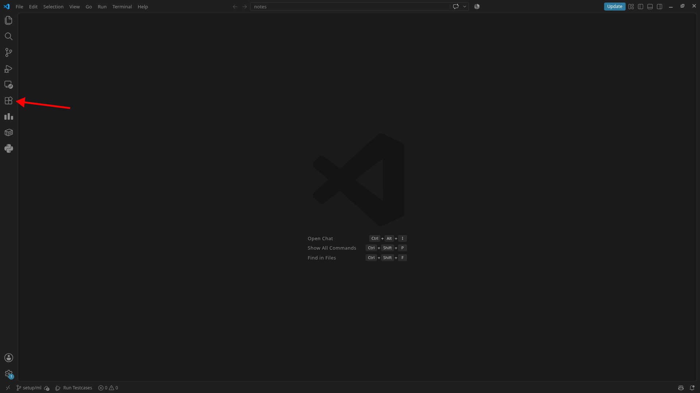

- [ ] **Python** (`ms-python.python`) & **Pylance** (`ms-python.vscode-pylance`): Autocomplete, type hints, and code navigation.
- [ ] **Jupyter** (`ms-toolsai.jupyter`): Run `.ipynb` notebooks natively inside VS Code without launching a browser server.
- [ ] **Ruff** (`charliermarsh.ruff`): Fast linting and code formatting built by the same creators as `uv`.

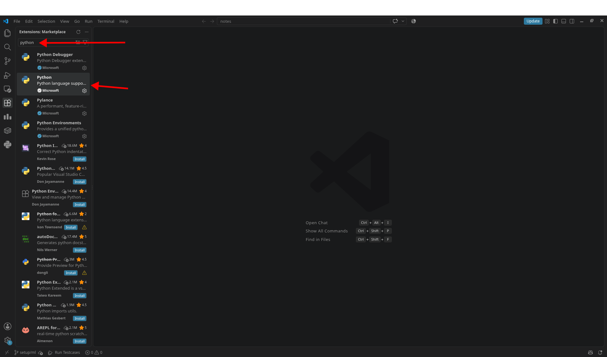  

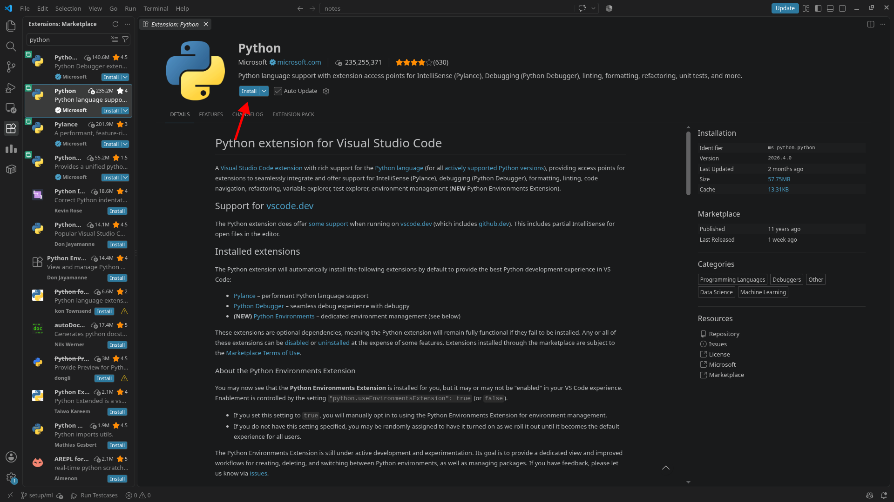  

---

## 2. Kaggle Account Setup

Kaggle is the standard community hub for datasets, competitions, and free cloud compute.

### Step 1: Register an Account
1. Go to [kaggle.com](https://www.kaggle.com).
2. Click **Register** in the top right.  
   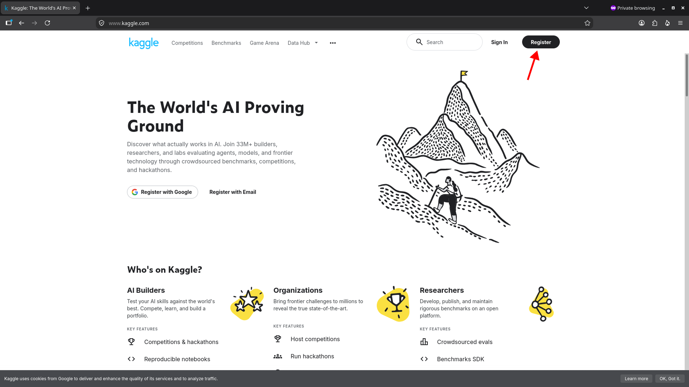  
3. Choose **Register with Google** for single-click sign-in, or use an email and password.
   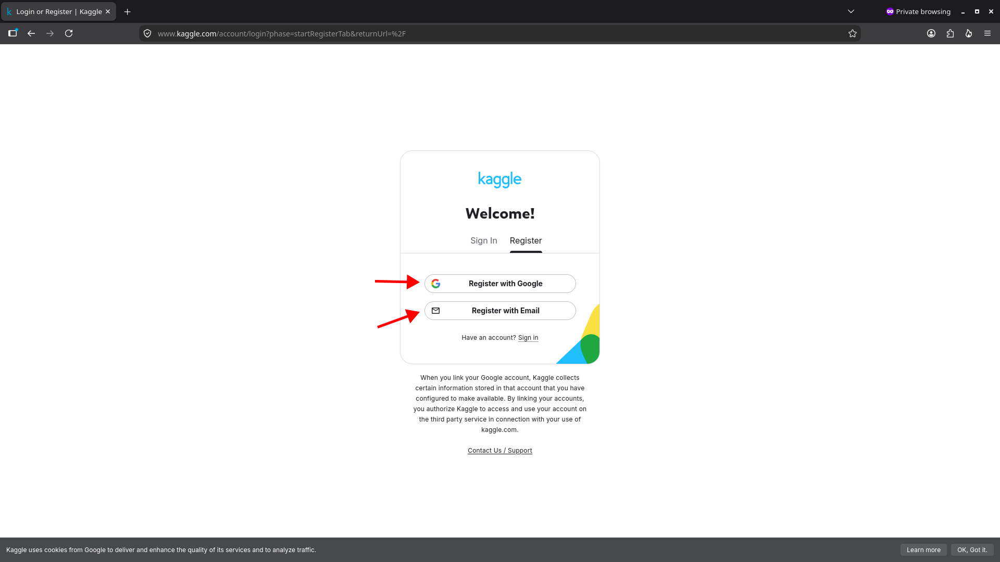  
4. Set a professional username (this forms your public Kaggle portfolio URL: `kaggle.com/your-username`).  
   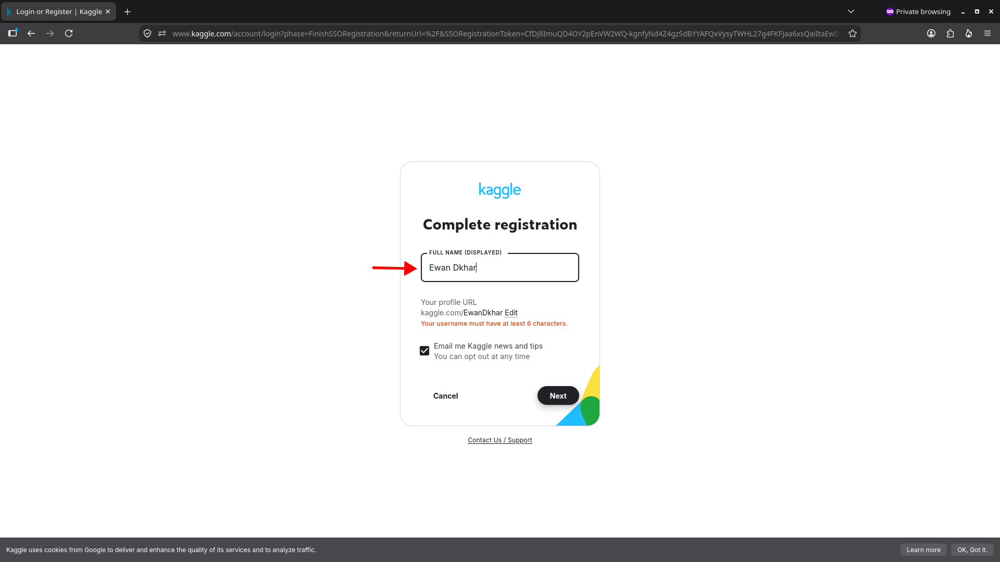  

### Step 2: Phone Verification (Mandatory for Compute)
> [!IMPORTANT]
> By default, new accounts cannot turn on GPUs/TPUs or enable internet access inside notebooks.

1. Click your profile avatar (top-right) $\rightarrow$ select **Settings**.  
   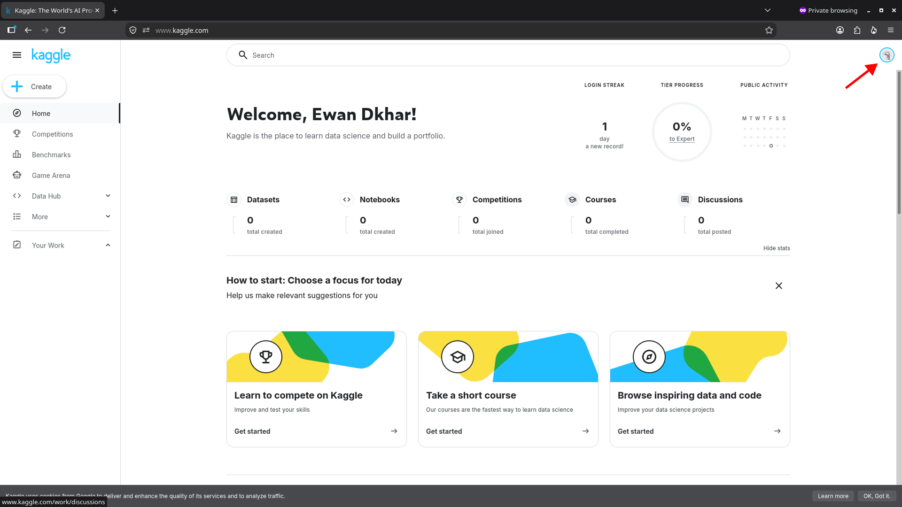  

   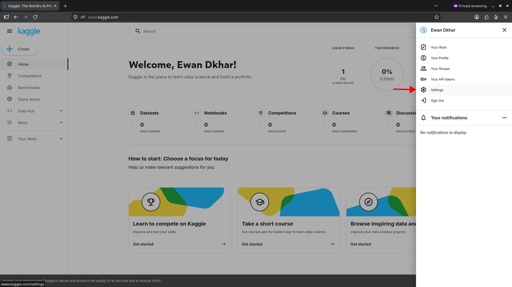  
2. Scroll to the **Phone verification** section.
   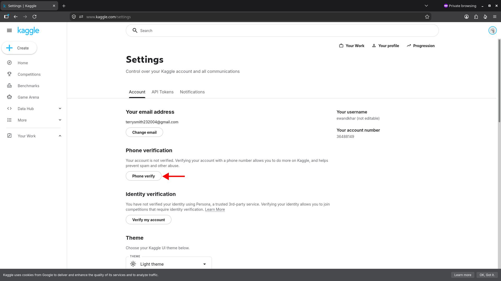  
3. Enter your phone number with your country code (e.g., `+91` for India) and verify the OTP sent via SMS.  
4. ✅ Once verified, your account unlocks **~30 hours/week** of free GPU quota (T4 / P100) and internet access inside Kaggle kernels.

### Step 3: Complete the Profile
   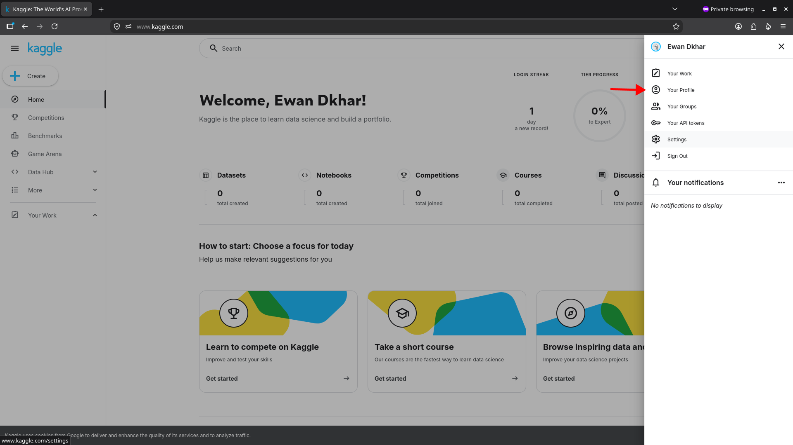  

1. Add a profile photo and short bio.
2. Link your **GitHub** and **LinkedIn** profiles so competition rankings and public notebooks act as resume credentials.  
   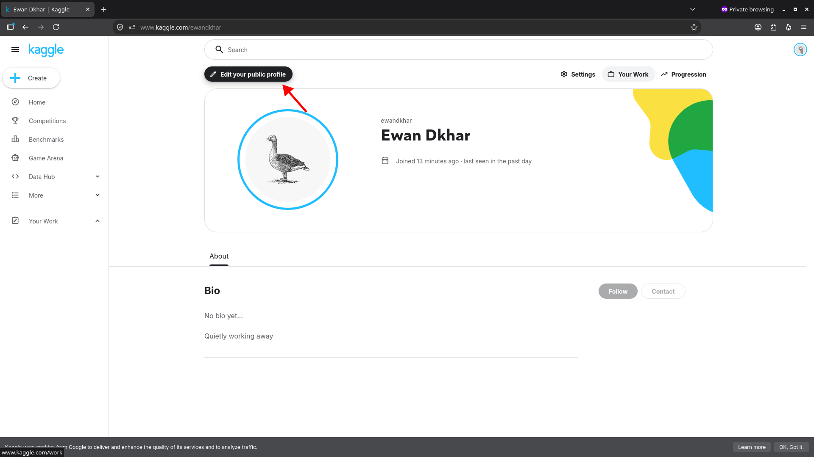  

   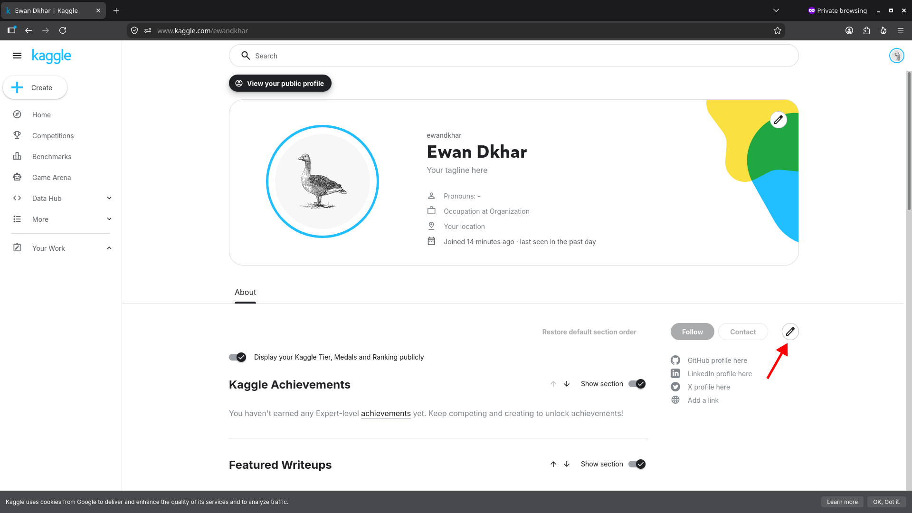  

     

---

## 3. Hugging Face Account Setup

Hugging Face is the central repository for pre-trained weights (LLMs, vision models), benchmarks, and raw datasets.

### Step 1: Sign Up & Verify Email
1. Navigate to [huggingface.co](https://huggingface.co).
2. Click **Sign Up** in the top-right corner.  
     
   *📸 Screenshot: Click "Sign Up" in the top-right corner*
3. Enter your email, password, and choose a username (e.g., `huggingface.co/your-username`).
4. **Immediate Action:** Check your inbox and click the verification link.  
   > [!WARNING]
   > Hugging Face disables community interactions, dataset forks, and gated model access until your email is confirmed.  
     
   *📸 Screenshot: Confirmation email in inbox with verification link*

### Step 2: Accept Community & Gated Model Terms
Many popular model weights (such as Meta's Llama series, Mistral, or Google's Gemma) are **gated models**. Freshers need an account to view and request access:

1. Search for a gated model (e.g., search `meta-llama/Llama-3.2-1B`).  
     
   *📸 Screenshot: Search bar finding `meta-llama/Llama-3.2-1B`*
2. Read and agree to the license agreement on the model card.
3. Click **Acknowledge license / Request access**.  
     
   *📸 Screenshot: Model card page showing "Acknowledge license / Request access" button*
4. Once approved (most are instantaneous), the account is permanently cleared to view the model weights and documentation.

### Step 3: Customize Profile Details
1. Go to **Settings** $\rightarrow$ **Profile**.  
     
   *📸 Screenshot: Profile avatar $\rightarrow$ Settings $\rightarrow$ Profile*
2. Fill in your GitHub handle, social links, and research interests (e.g., NLP, Computer Vision).
3. Any public Spaces (demo apps using Gradio/Streamlit) or custom datasets you create will appear under this profile.

---

## ✅ Quick Verification Checklist

- [ ] Installed VS Code extensions: **Python**, **Pylance**, **Jupyter**, and **Ruff**
- [ ] Registered Kaggle account and completed **Phone Verification** (GPU unlocked)
- [ ] Added Kaggle profile photo, bio, and linked GitHub/LinkedIn
- [ ] Registered Hugging Face account and **verified email**
- [ ] Requested access to a gated model (e.g., Llama 3.2 / Gemma)
- [ ] Added GitHub and research interests to Hugging Face profile
