# 5. Machine Learning Setup Guide

Essential setup for Machine Learning & Data Science: local VS Code environment, free cloud GPU compute on Kaggle, and open-source models on Hugging Face.

---

## 📑 Table of Contents

- [1. Editor & Notebook Tooling (VS Code)](#1-editor--notebook-tooling-vs-code)
- [2. Kaggle Account Setup](#2-kaggle-account-setup)
  - [Step 1: Register an Account](#step-1-register-an-account)
  - [Step 2: Phone Verification (Mandatory for Compute)](#step-2-phone-verification-mandatory-for-compute)
  - [Step 3: Complete the Profile](#step-3-complete-the-profile)
- [3. Hugging Face Account Setup](#3-hugging-face-account-setup)
  - [Step 1: Sign Up & Verify Email](#step-1-sign-up--verify-email)
  - [Step 2: Customize Profile Details](#step-2-customize-profile-details)
- [4. Quick Verification Checklist](#4-quick-verification-checklist)
- [Next Steps](#next-steps)

---

## 1. Editor & Notebook Tooling (VS Code)

Open VS Code, click the **Extensions** icon on the left sidebar (shortcut: `Ctrl + Shift + X` on Windows/Linux, `Cmd + Shift + X` on Mac), search for the following extensions, and click **Install**:

- **Python** (`ms-python.python`) & **Pylance** (`ms-python.vscode-pylance`): Autocomplete, type hints, and code navigation.
- **Jupyter** (`ms-toolsai.jupyter`): Run `.ipynb` notebooks natively inside VS Code without launching a browser server.
- **Ruff** (`charliermarsh.ruff`): Fast linting and code formatting built by the creators of `uv`.

  

  

---

## 2. Kaggle Account Setup

Kaggle is the standard community hub for datasets, competitions, and free cloud compute.

### Step 1: Register an Account
1. Go to [kaggle.com](https://www.kaggle.com).
2. Click **Register** in the top right.  
     
3. Choose **Register with Google** for single-click sign-in, or use an email and password.  
     
4. Set a professional username (this forms your public Kaggle portfolio URL: `kaggle.com/your-username`).  
     

### Step 2: Phone Verification (Mandatory for Compute)
> [!IMPORTANT]
> By default, new accounts cannot turn on GPUs/TPUs or enable internet access inside notebooks.

1. Click your profile avatar (top-right) -> select **Settings**.  
     

     
2. Scroll down to the **Phone verification** section and click **Phone verify**.  
     
3. Enter your phone number with your country code (e.g., `+91` for India), complete the captcha, and verify the OTP sent via SMS.  
     
4. ✅ Once verified, your account unlocks **~30 hours/week** of free GPU quota (T4 / P100) and internet access inside Kaggle kernels.

### Step 3: Complete the Profile

1. Click your profile avatar -> select **Your Profile**.  
     
2. Click **Edit your public profile**.  
     
3. Add a profile photo, display name, and tagline:  
   - Click the pencil icon on the profile banner:  
     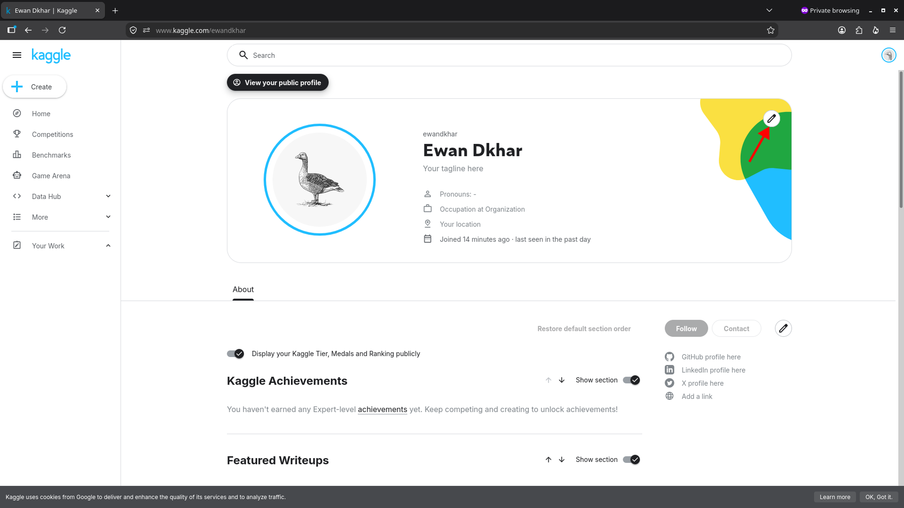  
   - Upload a photo, fill in your details, and click **Save changes**:  
     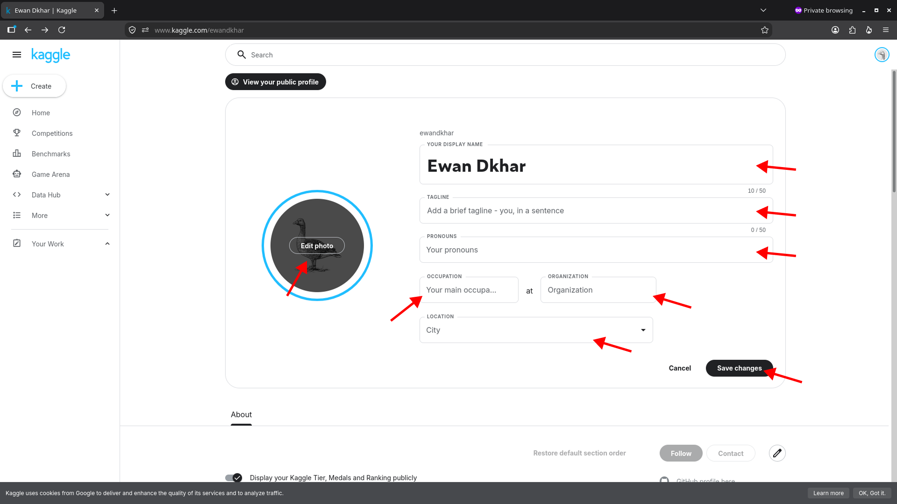  
4. Add a short bio:  
   - Scroll down to the **Bio** section and click the pencil icon:  
     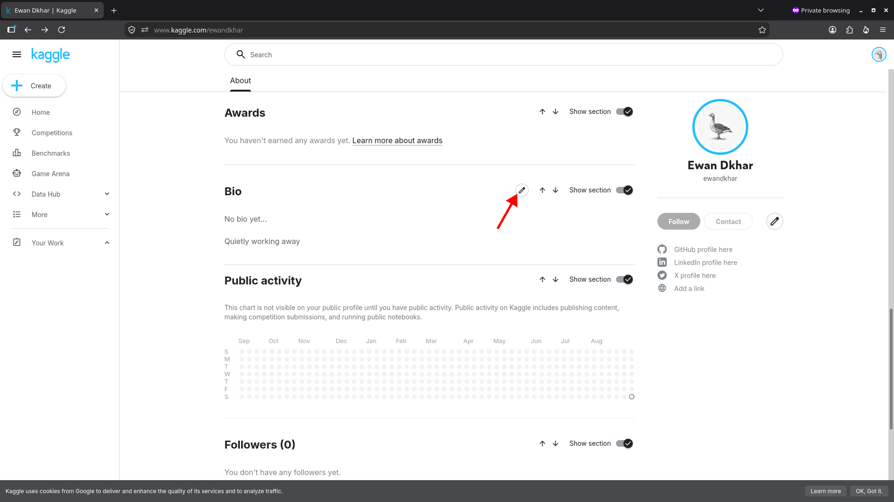  
   - Enter your bio and click **Save**:  
     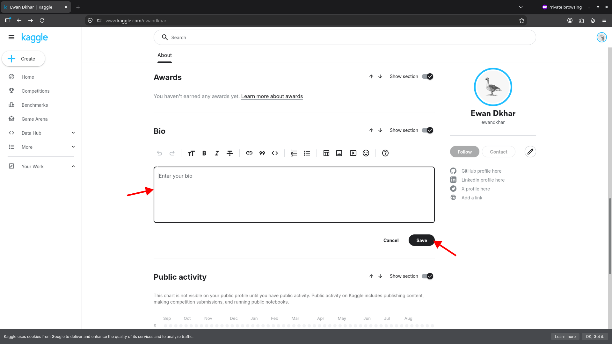  
5. Link your **GitHub** and **LinkedIn** profiles so competition rankings and public notebooks act as resume credentials:  
   - Click the pencil icon next to the social links section:  
       
   - Enter your GitHub username and LinkedIn URL:  
     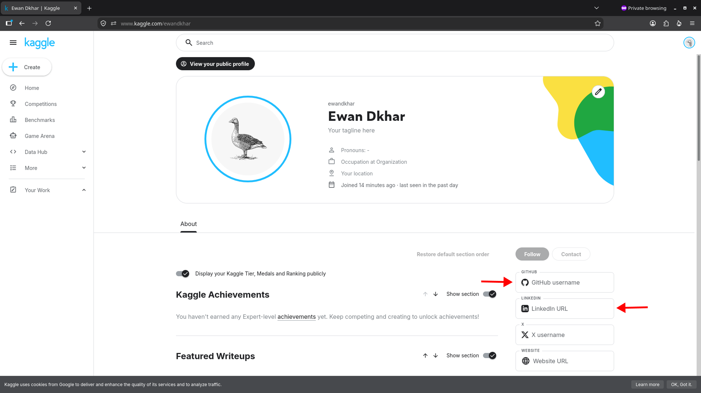   

---

## 3. Hugging Face Account Setup

Hugging Face is the central repository for pre-trained weights (LLMs, vision models), benchmarks, and raw datasets.

### Step 1: Sign Up & Verify Email
1. Navigate to [huggingface.co](https://huggingface.co).
2. Click **Sign Up** in the top-right corner.  
   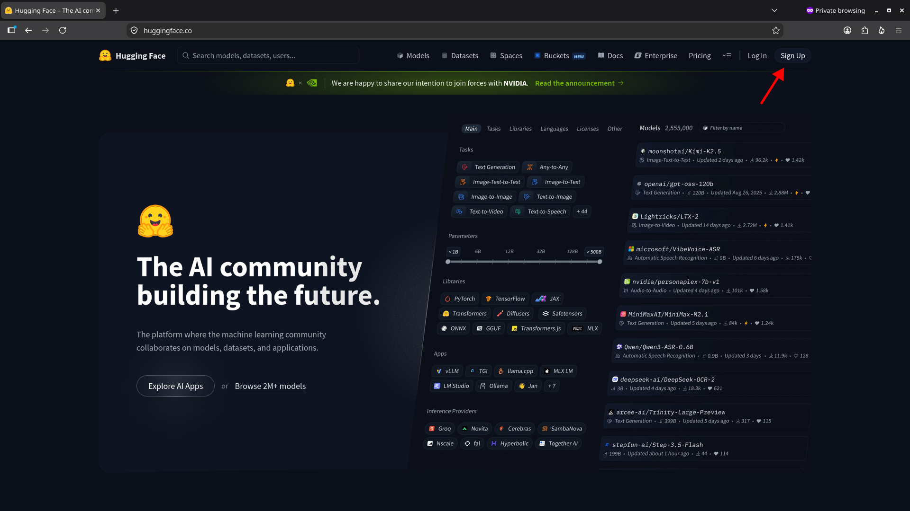  
3. Enter your email and password, then click **Next**.  
   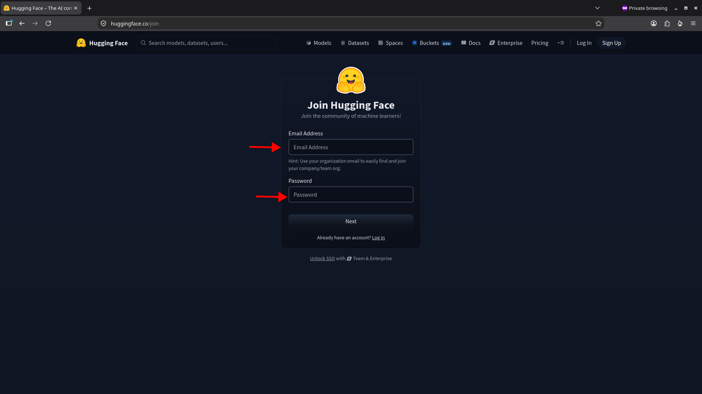  
4. Fill in your username, full name, agree to the Terms of Service, and click **Create Account**.  
   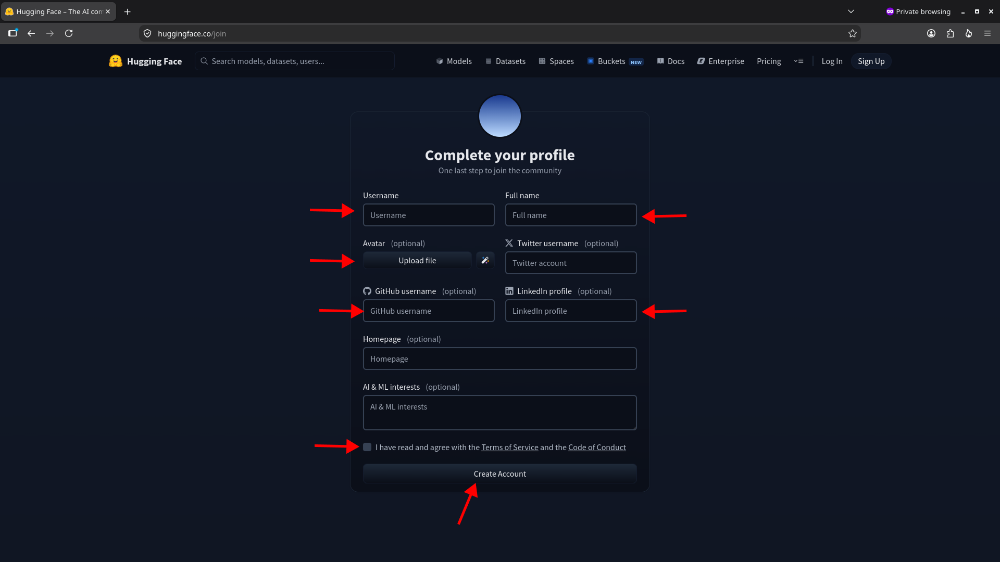  
   > [!WARNING]
   > Hugging Face disables community interactions, dataset forks, and model access until your email is confirmed. Open your inbox and click the verification link immediately.

### Step 2: Customize Profile Details
1. Click your profile avatar (top-right) -> select **Settings**.  
   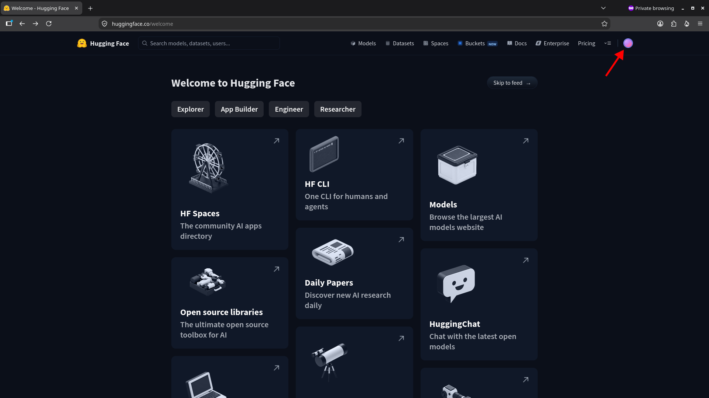  

   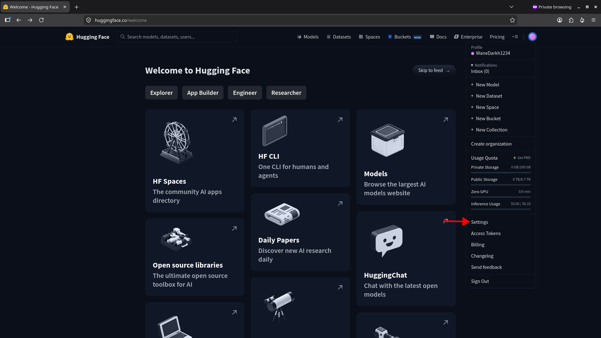  
2. Under **Profile Settings**, add your profile photo, GitHub handle, and social links:  
   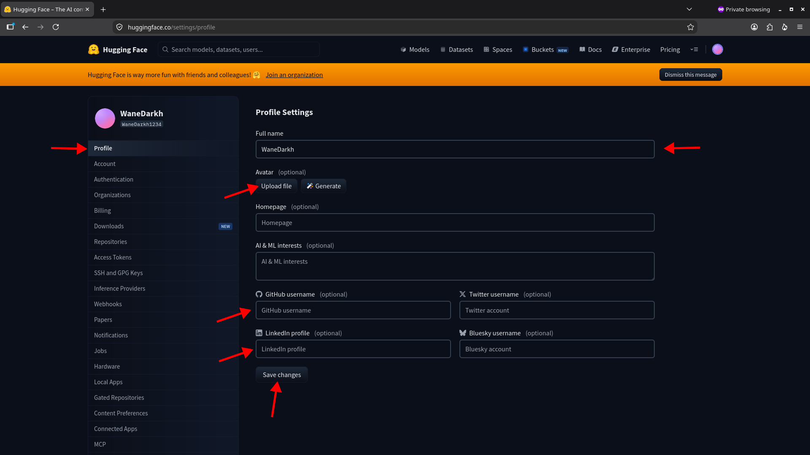  
3. Any public Spaces (demo apps using Gradio/Streamlit) or custom datasets you create will appear under this profile.

---

## 4. Quick Verification Checklist

- [ ] Installed VS Code extensions: **Python**, **Pylance**, **Jupyter**, and **Ruff**
- [ ] Registered Kaggle account and completed **Phone Verification** (GPU unlocked)
- [ ] Added Kaggle profile photo, bio, and linked GitHub/LinkedIn
- [ ] Registered Hugging Face account and **verified email**
- [ ] Added GitHub and research interests to Hugging Face profile

---

## Next Steps

- Proceed to the **[6. Quick Verification Checklist](checklist.md)** to verify your complete setup.
- Or return to the **[Basic Installation Overview](README.md)**.
