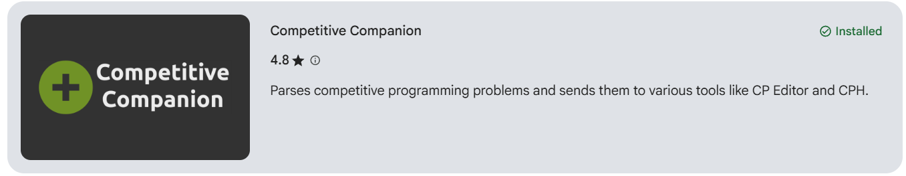
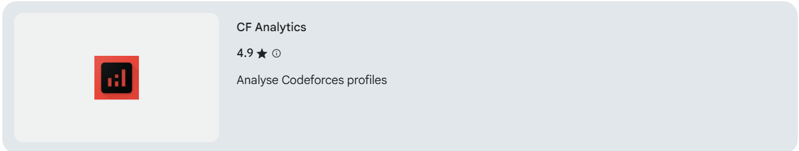
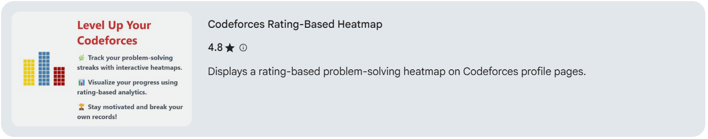
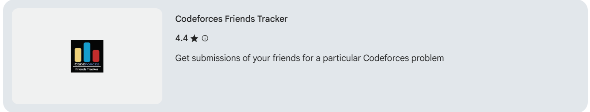
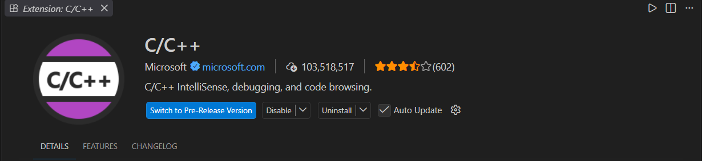
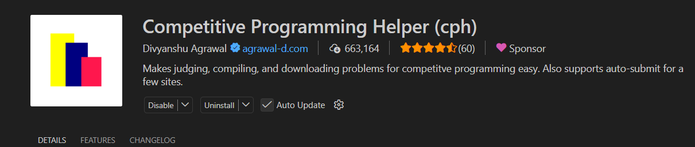
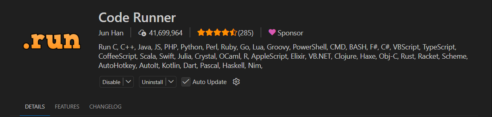
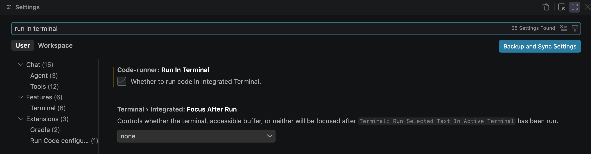
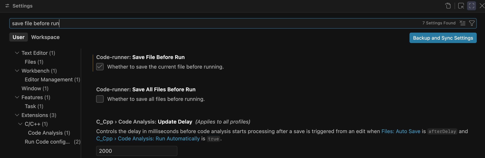

# 1. Universal Setup (Windows / macOS / Linux)

These steps are done directly in your web browser and code editor, so they are **identical across all operating systems**. Every fresher should complete this section first!

---

## 📑 Table of Contents

- [1.1 GitHub Account](#11-github-account)
- [1.2 Codeforces Account](#12-codeforces-account)
- [1.3 CodeChef Account](#13-codechef-account)
- [1.4 Kaggle Account (Free Cloud GPU Compute)](#14-kaggle-account-free-cloud-gpu-compute)
  - [Step 1: Register an Account](#step-1-register-an-account)
  - [Step 2: Phone Verification (Mandatory for Compute)](#step-2-phone-verification-mandatory-for-compute)
  - [Step 3: Complete the Profile](#step-3-complete-the-profile)
- [1.5 Hugging Face Account](#15-hugging-face-account)
  - [Step 1: Sign Up & Verify Email](#step-1-sign-up--verify-email)
  - [Step 2: Customize Profile Details](#step-2-customize-profile-details)
- [1.6 Web3 Accounts, Wallets & Tools (Onchain IIITL)](#16-web3-accounts-wallets--tools-onchain-iiitl)
  - [1. MetaMask (Ethereum & EVM Wallet)](#1-metamask-ethereum--evm-wallet)
  - [2. Phantom Wallet (Solana Wallet)](#2-phantom-wallet-solana-wallet)
  - [3. Web3 Developer Tools & Explorers](#3-web3-developer-tools--explorers)
  - [4. Connect with Onchain IIITL](#4-connect-with-onchain-iiitl)
- [1.7 Recommended Browser Extensions](#17-recommended-browser-extensions)
  - [Competitive Programming Extensions](#for-competitive-programming-codeforces--codechef)
  - [Web Development Extensions](#for-web-development)
- [1.8 Essential VS Code Extensions](#18-essential-vs-code-extensions)
  - [C / C++ & Competitive Programming](#c--c--competitive-programming)
  - [Python, Machine Learning & Data Science](#python-machine-learning--data-science)
  - [Web Development](#web-development)
  - [Quality of Life & Themes](#quality-of-life--themes)
- [Next Steps](#next-steps)

---

## 1.1 GitHub Account
GitHub is where developers store, share, and collaborate on code. Think of it as Google Drive or cloud storage, but built specifically for code.

1. Visit [www.github.com](https://www.github.com).
2. Click **Sign up** in the top right corner.
   
3. Enter your email address, create a strong password, and choose a professional username (avoid silly nicknames; you will put this on your resume!). You can also continue with Google or Apple.
   
4. Complete the quick captcha puzzle (if prompted) and enter the 6-digit OTP code sent to your email.
   
5. Your GitHub account is now created! Keep your credentials safe.

---

## 1.2 Codeforces Account
Codeforces is one of the most popular platforms in the world for competitive programming and coding contests.

1. Visit [https://codeforces.com/](https://codeforces.com/).
2. Click **Register** on the top right corner.
   
3. Choose a professional handle (username), enter your email address, and create a secure password (you can also register using your Gmail account).
   
4. Check your email inbox. You will receive an email with a verification link — click that link to activate your account.
5. Your Codeforces account is ready!

---

## 1.3 CodeChef Account
CodeChef is an Indian competitive programming platform widely used for monthly contests, learning data structures, and college hackathons.

1. Visit [https://www.codechef.com/](https://www.codechef.com/).
2. Click the **Sign Up** button in the top right corner.
   
3. You can sign up using your **Google Account**, or enter your details manually:
   
   - Enter your Full Name.
   - Enter your Email.
   - Set a strong Password.
   - Check the Terms & Privacy Policy agreement, then click **REGISTER**.
   - Click **Create Account**. If an email verification link is sent, open your inbox and click the verification link.

    

   

   
    
   
   
   

4. Fill in your basic student details:
   - Country: **India**
   - Current Institution / College Name: `Indian Institute of Information Technology, Lucknow Uttar Pradesh, India`.
   - Graduation Year: `2030`.
   - User Type: **Student**
   - Preferred Programming Language: `C++`.

    
   

5. If you want, you can update your username:
   
   

---

## 1.4 Kaggle Account (Free Cloud GPU Compute)

Kaggle is the standard community hub for datasets, competitions, and free cloud GPU compute (essential for running and training machine learning models without needing a dedicated GPU on your laptop).

### Step 1: Register an Account
1. Go to [kaggle.com](https://www.kaggle.com).
2. Click **Register** in the top right.  
     
3. Choose **Register with Google** for single-click sign-in, or use an email and password.  
     
4. Set a professional username (this forms your public Kaggle portfolio URL: `kaggle.com/your-username`).  
     

### Step 2: Phone Verification (Mandatory for Compute)
> [!IMPORTANT]
> By default, new accounts cannot turn on GPUs/TPUs or enable internet access inside notebooks. Phone verification is required to unlock free compute quotas!

1. Click your profile avatar (top-right) -> select **Settings**.  
     

     
2. Scroll down to the **Phone verification** section and click **Phone verify**.  
     
3. Enter your phone number with your country code (e.g., `+91` for India), complete the captcha, and verify the OTP sent via SMS.  
     
4. ✅ Once verified, your account unlocks **~30 hours/week** of free GPU quota (NVIDIA T4 / P100) and internet access inside Kaggle kernels.

### Step 3: Complete the Profile

1. Click your profile avatar -> select **Your Profile**.  
     
2. Click **Edit your public profile**.  
     
3. Add a profile photo, display name, and tagline:  
   - Click the pencil icon on the profile banner:  
       
   - Upload a photo, fill in your details, and click **Save changes**:  
       
4. Add a short bio:  
   - Scroll down to the **Bio** section and click the pencil icon:  
       
   - Enter your bio and click **Save**:  
       
5. Link your **GitHub** and **LinkedIn** profiles so competition rankings and public notebooks act as resume credentials:  
   - Click the pencil icon next to the social links section:  
       
   - Enter your GitHub username and LinkedIn URL:  
        

---

## 1.5 Hugging Face Account

Hugging Face is the central repository for pre-trained weights (LLMs, vision models), benchmarks, and raw datasets.

### Step 1: Sign Up & Verify Email
1. Navigate to [huggingface.co](https://huggingface.co).
2. Click **Sign Up** in the top-right corner.  
     
3. Enter your email and password, then click **Next**.  
     
4. Fill in your username, full name, agree to the Terms of Service, and click **Create Account**.  
     
   > [!WARNING]
   > Hugging Face disables community interactions, dataset forks, and model access until your email is confirmed. Open your inbox and click the verification link immediately.

### Step 2: Customize Profile Details
1. Click your profile avatar (top-right) -> select **Settings**.  
     

     
2. Under **Profile Settings**, add your profile photo, GitHub handle, and social links:  
     
3. Any public Spaces (demo apps using Gradio/Streamlit) or custom datasets you create will appear under this profile.

---

## 1.6 Web3 Accounts, Wallets & Tools (Onchain IIITL)

Web3 and blockchain development involve interacting with decentralized networks, smart contracts, and cryptocurrency testnets. The following browser extensions and tools are used in all Web3 Wing / Onchain IIITL sessions:

### 1. MetaMask (Ethereum & EVM Wallet)
MetaMask is the most widely used self-custodial crypto wallet for Ethereum and EVM-compatible blockchains.

1. Go to the official MetaMask website: [https://metamask.io/](https://metamask.io/)
2. Click **Download** and install the extension for your browser (Chrome, Firefox, Edge, Brave).
3. After installation, pin MetaMask to your browser toolbar.
4. Open MetaMask and click **Create a Wallet**.
5. Set a **strong password**:
   > [!WARNING]
   > Make sure to create a password you can remember, as it cannot be reset if you lose it!
   
   

6. **Save your Secret Recovery Phrase (SRP)** securely: Write down the 12-word seed phrase on paper and keep it safe offline. Do not share this phrase with anyone.
7. Once done, your MetaMask wallet is ready!

#### Add Sepolia Testnet to MetaMask:
Sepolia is the primary proof-of-stake Ethereum test network used by developers to test smart contracts without spending real funds.

1. Open MetaMask.
2. At the top, click the **Network Selector**.
3. Click **Show/Hide test networks** (enable testnets if not already enabled).

   

   

   

4. Select **Sepolia Test Network**.

   

   

5. Done ✅

#### Useful Links & Free Sepolia ETH Faucet:
- **ChainList:** [https://chainlist.org/](https://chainlist.org/) (Quickly search and add any EVM network with one click)
- **Etherscan (Mainnet):** [https://etherscan.io/](https://etherscan.io/)
- **Sepolia Etherscan:** [https://sepolia.etherscan.io/](https://sepolia.etherscan.io/)
- **Sepolia Faucet (Google Cloud):** [https://cloud.google.com/application/web3/faucet/ethereum/sepolia](https://cloud.google.com/application/web3/faucet/ethereum/sepolia)
  1. Visit the Sepolia Faucet link above.
  2. Select the **Ethereum Sepolia** network.
  3. Enter your MetaMask **Wallet Address** (starts with `0x`).
  4. Click **Request Sepolia ETH**. Within seconds, you'll receive test ETH in your wallet.

  

---

### 2. Phantom Wallet (Solana Wallet)
Phantom is the standard self-custodial wallet for the Solana blockchain ecosystem.

1. Go to the official Phantom website: [https://phantom.com/](https://phantom.com/)
2. Click **Download** and install the extension for your browser.
3. Pin **Phantom** to your browser toolbar.
4. Open Phantom and click **Create a Wallet**:
   - Set a strong password.
   - **Save your Secret Recovery Phrase (SRP)** securely offline.
5. **Add Solana Devnet to Phantom:**
   - Open Phantom.
   - At the top left, click your profile logo -> go to **Settings**.
   - Click **Developer Settings**.
   - Enable **Testnet Mode** and choose **Solana Devnet**.
6. **Airdrop Free Solana (Faucet):**
   - Visit the **Solana Faucet**: [https://faucet.solana.com/](https://faucet.solana.com/)
   - Select the **devnet** network.
   - Connect your **GitHub** account.
   - Enter your Phantom **Wallet Address**.
   - Click **Confirm Airdrop**. Within seconds, you'll receive test SOL in your wallet.

---

### 3. Web3 Developer Tools & Explorers
Bookmark all of these essential developer tools:

- **Etherscan:** [https://etherscan.io/](https://etherscan.io/) (Mainnet) & [https://sepolia.etherscan.io/](https://sepolia.etherscan.io/) (Sepolia Testnet)
  - Paste any wallet address to view balance and full transaction history.
  - Paste any transaction hash to see real-time confirmation status.
  - Open any smart contract to read its verified code and execute its functions under the **Contract** tab.
- **Solana Explorer:** [https://explorer.solana.com/](https://explorer.solana.com/)
  - Official block explorer for Solana. Switch to **Devnet** using the cluster selector in the top-right corner when inspecting your own transactions and deployed programs.
- **Solscan:** [https://solscan.io/](https://solscan.io/)
  - Alternative Solana explorer with a clean UI for browsing token accounts, NFTs, and DeFi positions.
- **Remix IDE:** [https://remix.ethereum.org/](https://remix.ethereum.org/)
  - Browser-based IDE for writing, compiling, and deploying **Solidity** smart contracts — zero local setup required!
  - **Quick Start:**
    1. Open Remix in your browser.
    2. In the file explorer, create a new file ending in `.sol`.
    3. Write your Solidity contract.
    4. Go to the **Solidity Compiler** tab -> click **Compile**.
    5. Go to the **Deploy & Run Transactions** tab.
    6. Under **Environment**, select **Injected Provider - MetaMask**.
    7. Ensure MetaMask is set to **Sepolia testnet**.
    8. Click **Deploy** and confirm the transaction in MetaMask.

  

---

### 4. Connect with Onchain IIITL
Follow Onchain IIITL (Axios Web3 Wing) and core members on X (Twitter) for upcoming workshops, hackathons, and project updates:


- [Parth B (@brokendopen)](https://x.com/iamparthbadgire)
- [Nilanjan Chavan (@NilanjanHehe)](https://x.com/NilanjanHehe)
- [Palak Dasauni (@palakdasauni13)](https://x.com/palakdasauni13)
- [Lakshya (@lakshya_117)](https://x.com/lakshya_117)
- [Harshita Punia (@harshita_punia)](https://x.com/harshita_punia)

---

## 1.7 Recommended Browser Extensions
Install these browser extensions (available on Chrome Web Store, Firefox Add-ons, and Microsoft Edge Add-ons) to make your coding and contest experience 10x smoother:

### For Competitive Programming (Codeforces / CodeChef):
1. **Competitive Companion**:
   - Parses problem test cases directly from Codeforces, CodeChef, AtCoder, CSES, etc., into your VS Code editor with a single click.
   - [Chrome / Edge / Brave Web Store](https://chromewebstore.google.com/detail/competitive-companion/cjnmckjndlpiamhfimnnjmnckgghkjbl?utm_source=item-share-cb)
   - [Firefox Add-ons](https://addons.mozilla.org/en-US/firefox/addon/competitive-companion/)
   - Pin the extension to your browser toolbar so it's always accessible!
   
   

2. **Carrot**:
   - Calculates and displays predicted Codeforces rating changes in real-time during live contests.
   - [Chrome Web Store Link](https://chromewebstore.google.com/detail/gakohpplicjdhhfllilcjpfildodfnnn?utm_source=item-share-cb)
   
   

3. **CF Analytics**:
   - Analyzes your Codeforces profile, problem-solving streaks, topic breakdown, and difficulty distribution.
   - [Chrome Web Store Link](https://chromewebstore.google.com/detail/cf-analytics/hhljbjodjdbjbggddjaidojnlmaobcpo)
   
   

4. **Codeforces Rating-Based Heatmap**:
   - Adds an interactive, GitHub-style daily problem-solving heatmap directly on your Codeforces profile.
   - [Chrome Web Store Link](https://chromewebstore.google.com/detail/codeforces-rating-based-h/heajdhmohlobjebkgkpdomkaihaghkgb?hl=en)
   
   

5. **Codeforces Friends Tracker**:
   - Quickly view submissions made by friends on any specific Codeforces problem during practice.
   - [Chrome Web Store Link](https://chromewebstore.google.com/detail/codeforces-friends-tracke/gfdmmpimafkhcdekeddfeifcmcjbadam)
   
   

6. **College & Custom Standings**:
   - **Codeforces College Standings** ([Chrome / Brave](https://chromewebstore.google.com/detail/codeforces-college-standi/jebplnggddknopemgddcfadflgffcbpd)): Filters live contest standings specifically for IIIT Lucknow students.
   - **Codeforces Custom Standings** ([Firefox](https://addons.mozilla.org/en-US/firefox/addon/codeforces-custom-standings/)): Custom leaderboard filtering on Firefox.

7. **CF FetchCodes**:
   - Quickly fetch and inspect problem solutions and test data for contest analysis.
   - [Chrome Web Store Link](https://chromewebstore.google.com/detail/cf-fetchcodes/ombmefkchmjbodcoboeagbpaejfojnga)

### For Web Development:
1. **JSON Viewer / JSON Formatter**:
   - Makes API responses and JSON files clean, colorful, and readable in the browser instead of raw unreadable text.
   - [JSON Formatter](https://chromewebstore.google.com/detail/bcjindcccaagfpapjjmafapmmgkkhgoa?utm_source=item-share-cb)
   - [JSON Viewer](https://chromewebstore.google.com/detail/aimiinbnnkboelefkjlenlgimcabobli?utm_source=item-share-cb)
2. **React Developer Tools** *(optional for later)*:
   - Inspects React component hierarchies in the browser's developer tools.
   - [Chrome Web Store Link](https://chromewebstore.google.com/detail/fmkadmapgofadopljbjfkapdkoienihi?utm_source=item-share-cb)

> [!IMPORTANT]
> **Have you installed VS Code and compilers yet?**
> You cannot install VS Code extensions until VS Code itself is installed! If you haven't installed it yet, jump to your operating system guide first to install VS Code, compilers, and Git:
> - 🪟 **[2. Windows Setup Guide](windows.md)**
> - 🍎 **[3. macOS Setup Guide](macos.md)**
> - 🐧 **[4. Linux Setup Guide](linux.md)**
>
> Once your OS setup is complete, return here to install your extensions!

---

## 1.8 Essential VS Code Extensions
Once you install VS Code (from your OS guide), open VS Code, click the **Extensions** icon on the left sidebar (shortcut: `Ctrl + Shift + X` on Windows/Linux, `Cmd + Shift + X` on Mac), search for the following extensions, and click **Install**:

### C / C++ & Competitive Programming:
1. **C/C++** (by Microsoft):
   - Syntax highlighting, code completion (IntelliSense), and debugging.
   
   

2. **Competitive Programming Helper (cph)** (by Divyanshu Agrawal):
   - The #1 extension for CP! Auto-fetches test cases via Competitive Companion and runs your code against all inputs in one click (`Ctrl + Shift + U`).
   
   

3. **Code Runner** (by Jun Han):
   - Run code files or selected snippets with a single click (Play button in the top-right) or shortcut (`Ctrl + Alt + N` on Windows/Linux, `Cmd + Option + N` on Mac).
   
   

#### Essential Code Runner Settings (Do Not Skip!):
By default, Code Runner runs in the read-only Output panel (which prevents entering terminal input like `cin`) and doesn't auto-save before compiling. Configure these two settings:
1. Open VS Code Settings (`Ctrl + ,` on Windows/Linux, `Cmd + ,` on Mac).
2. Search for `run in terminal` -> **Check the box for "Code-runner: Run In Terminal"**:
   
   

3. Search for `save file before run` -> **Check the box for "Code-runner: Save File Before Run"**:
   
   

> [!TIP]
> **Enable Auto Save in VS Code:**
> Press `Ctrl + Shift + P` (or `Cmd + Shift + P` on Mac), type `File: Toggle Auto Save`, and hit Enter. This ensures your code is never lost or unsaved when testing!
>
> 

#### Workflow: How to Use Competitive Companion + CPH
1. Open any problem on Codeforces or CodeChef in your browser.
2. Click the green **`+`** icon of Competitive Companion in your browser extensions bar:
   
   

3. Switch to VS Code. If prompted, select **`cpp`**. The problem with its official sample testcases will appear instantly:
   
   

4. Write your solution in the created file and click **Run testcase** to verify your solution:
   
   

### Python, Machine Learning & Data Science:
- **Python** (`ms-python.python` by Microsoft): Autocomplete, linting, debugging, and multi-environment selection.
- **Pylance** (`ms-python.vscode-pylance` by Microsoft): High-performance language support, type checking, and auto-imports.
- **Jupyter** (`ms-toolsai.jupyter` by Microsoft): Run interactive `.ipynb` notebooks directly inside VS Code without launching a browser server.
- **Ruff** (`charliermarsh.ruff` by Astral): Extremely fast Python linter and code formatter built in Rust by the creators of `uv`.

  

  

#### Managing Python Packages with `uv` (Avoiding PEP 668 Errors)
On modern operating systems (Ubuntu 24.04+, Debian 12+, Fedora, Arch, and macOS Homebrew), running global `pip install` is blocked by the OS (`error: externally-managed-environment`). Always use **`uv`** (which we install in the OS guides) to manage virtual environments and packages at 10x–100x the speed of standard pip:

1. **Create a Virtual Environment:**
   Inside your project or coursework folder:
   ```bash
   uv venv
   ```
2. **Activate the Virtual Environment:**
   - **Windows (PowerShell):**
     ```powershell
     .venv\Scripts\Activate.ps1
     ```
   - **macOS / Linux:**
     ```bash
     source .venv/bin/activate
     ```
3. **Install Packages Blazingly Fast:**
   ```bash
   uv pip install numpy pandas matplotlib torch
   ```
4. **Or Run Scripts Directly Without Manual Activation:**
   ```bash
   uv run script.py
   ```

#### Local Jupyter Notebooks Setup:
When working with Jupyter notebooks (`.ipynb`) in VS Code:
1. Inside your project folder, install the IPython kernel:
   ```bash
   uv pip install ipykernel
   ```
2. Open your `.ipynb` file in VS Code.
3. Click **Select Kernel** in the top-right corner &rarr; select **Python Environments...** &rarr; choose your project's **`.venv`**.

### Web Development:
- **Live Server** (by Ritwick Dey): Launch a local development server with live reload for HTML/CSS/JavaScript.
- **Prettier - Code Formatter**: Automatically cleans up and formats your code nicely whenever you save.
- **Auto Rename Tag**: Automatically renames paired HTML/XML tags.
- **Tailwind CSS IntelliSense**: Autocomplete and preview for Tailwind CSS classes.

### Quality of Life & Themes:
- **Error Lens**: Highlights syntax errors and warnings inline directly on your code lines so you spot bugs instantly.
- **Material Icon Theme**: Makes your file and folder icons beautiful and easy to distinguish.

---

## Next Steps

- Finished installing all extensions and tools? Head over to the **[5. Quick Verification Checklist](checklist.md)** to verify your setup!
- Haven't completed your operating system setup yet? Head to your OS guide:
  - 🪟 **[2. Windows Setup Guide](windows.md)**
  - 🍎 **[3. macOS Setup Guide](macos.md)**
  - 🐧 **[4. Linux Setup Guide](linux.md)**
- Or return to the **[Basic Installation Overview](README.md)**.
