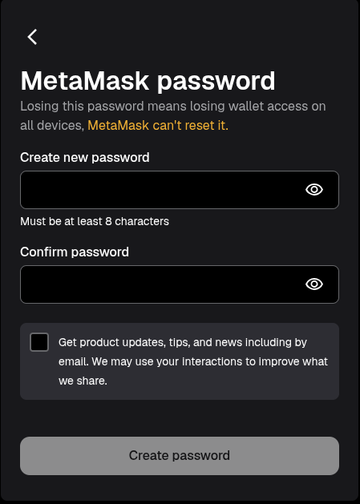

# 04. Web3 Wallets & Ecosystem Setup (Onchain IIITL)

Web3 and blockchain development involve interacting with decentralized networks, smart contracts, and cryptocurrency testnets. The following browser extensions and tools are used in all Web3 Wing / Onchain IIITL sessions.

---

## 1. MetaMask (Ethereum & EVM Wallet)

MetaMask is the most widely used self-custodial crypto wallet for Ethereum and EVM-compatible blockchains.

### Step-by-Step Installation & Setup:

1. Navigate to the official MetaMask website: [https://metamask.io/](https://metamask.io/)
2. Click **Download** and install the extension for your browser (Chrome, Firefox, Edge, or Brave).
3. After installation, pin MetaMask to your browser toolbar for easy access.
4. Open MetaMask and click **Create a Wallet**.
5. Set a **strong password**:
   > [!WARNING]
   > Make sure to create a password you can remember, as it cannot be reset if you lose it!
   
   

6. **Save your Secret Recovery Phrase (SRP) securely**: Write down the 12-word seed phrase on paper and store it safely offline. **Never share this phrase with anyone**, not even club leads or recruiters.
7. Once confirmed, your MetaMask wallet is ready!

### Add Sepolia Testnet to MetaMask:
Sepolia is the primary proof-of-stake Ethereum test network used by developers to test smart contracts without spending real money.

1. Open MetaMask.
2. At the top, click the **Network Selector**.
3. Click **Show/Hide test networks** (toggle testnets on if not already enabled).

   

   

   

4. Select **Sepolia Test Network**.

   

   

5. Done! Your wallet is now connected to Sepolia.

### Useful Links & Free Sepolia ETH Faucet:
- **ChainList:** [https://chainlist.org/](https://chainlist.org/) (Quickly search and add any EVM network with one click)
- **Etherscan (Mainnet):** [https://etherscan.io/](https://etherscan.io/)
- **Sepolia Etherscan:** [https://sepolia.etherscan.io/](https://sepolia.etherscan.io/)
- **Sepolia Faucet (Google Cloud):** [https://cloud.google.com/application/web3/faucet/ethereum/sepolia](https://cloud.google.com/application/web3/faucet/ethereum/sepolia)
  1. Visit the Sepolia Faucet link above.
  2. Select the **Ethereum Sepolia** network.
  3. Enter your MetaMask **Wallet Address** (starts with `0x`).
  4. Click **Request Sepolia ETH**. Within seconds, you'll receive test ETH in your wallet.

  

---

## 2. Phantom Wallet (Solana Wallet)

Phantom is the standard self-custodial wallet for the Solana blockchain ecosystem.

### Step-by-Step Installation & Setup:

1. Navigate to the official Phantom website: [https://phantom.com/](https://phantom.com/)
2. Click **Download** and install the extension for your browser.
3. Pin **Phantom** to your browser toolbar.
4. Open Phantom and click **Create a Wallet**:
   - Set a strong password.
   - **Save your Secret Recovery Phrase (SRP)** securely offline.
5. **Add Solana Devnet to Phantom:**
   - Open Phantom.
   - At the top left, click your profile logo -> go to **Settings**.
   - Click **Developer Settings**.
   - Enable **Testnet Mode** and choose **Solana Devnet**.
6. **Airdrop Free Solana (Faucet):**
   - Visit the **Solana Faucet**: [https://faucet.solana.com/](https://faucet.solana.com/)
   - Select the **devnet** network.
   - Connect your **GitHub** account.
   - Enter your Phantom **Wallet Address**.
   - Click **Confirm Airdrop**. Within seconds, you will receive test SOL in your devnet wallet.

---

## 3. Web3 Developer Tools & Explorers

Bookmark these essential developer tools:

- **Etherscan:** [https://etherscan.io/](https://etherscan.io/) (Mainnet) & [https://sepolia.etherscan.io/](https://sepolia.etherscan.io/) (Sepolia Testnet)
  - Paste any wallet address to view balance and full transaction history.
  - Paste any transaction hash to see real-time confirmation status.
  - Open any smart contract to read its verified code and execute its functions under the **Contract** tab.
- **Solana Explorer:** [https://explorer.solana.com/](https://explorer.solana.com/)
  - Official block explorer for Solana. Switch to **Devnet** using the cluster selector in the top-right corner when inspecting your own transactions and deployed programs.
- **Solscan:** [https://solscan.io/](https://solscan.io/)
  - Alternative Solana explorer with a clean UI for browsing token accounts, NFTs, and DeFi positions.
- **Remix IDE:** [https://remix.ethereum.org/](https://remix.ethereum.org/)
  - Browser-based IDE for writing, compiling, and deploying **Solidity** smart contracts — zero local setup required!
  - **Quick Start:**
    1. Open Remix in your browser.
    2. In the file explorer, create a new file ending in `.sol`.
    3. Write your Solidity contract.
    4. Go to the **Solidity Compiler** tab -> click **Compile**.
    5. Go to the **Deploy & Run Transactions** tab.
    6. Under **Environment**, select **Injected Provider - MetaMask**.
    7. Ensure MetaMask is set to **Sepolia testnet**.
    8. Click **Deploy** and confirm the transaction in MetaMask.

  

---

## 4. Connect with Onchain IIITL

Follow Onchain IIITL (Axios Web3 Wing) and core members on X (Twitter) for upcoming workshops, hackathons, and project updates:

- [Parth B (@brokendopen)](https://x.com/iamparthbadgire)
- [Nilanjan Chavan (@NilanjanHehe)](https://x.com/NilanjanHehe)
- [Palak Dasauni (@palakdasauni13)](https://x.com/palakdasauni13)
- [Lakshya (@lakshya_117)](https://x.com/lakshya_117)
- [Harshita Punia (@harshita_punia)](https://x.com/harshita_punia)

---

👉 **Universal Setup Complete!** Proceed to your operating system's specific setup guide:
- **[Windows Setup Guide](../windows/README.md)**
- **[macOS Setup Guide](../macos/README.md)**
- **[Linux Setup Guide](../linux/README.md)**
