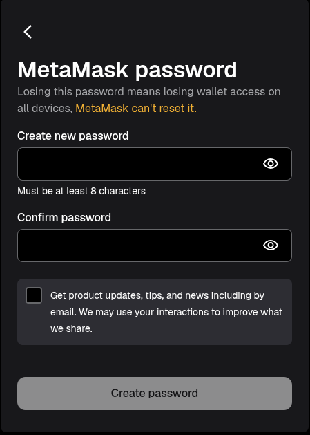

# 🌐 Web3 Wing — Complete Setup Guide

> Welcome to Web3 Wing! This guide will walk you through everything you need to set up your development environment. Follow each section in order and don't skip anything.

---

## 📑 Table of Contents

- [✅ Section 1 — Prerequisites](#-section-1--prerequisites-make-sure-you-have-these-already)
  - [Git](#-git)
  - [GitHub](#-github)
  - [VS Code](#-vs-code)
  - [Node.js](#-nodejs)
  - [WSL (Windows Subsystem for Linux)](#-wsl-windows-subsystem-for-linux)
- [🦊 Section 2 — MetaMask (Ethereum Wallet)](#-section-2--metamask-ethereum-wallet)
  - [Add Sepolia Testnet to MetaMask](#-add-sepolia-testnet-to-metamask)
  - [Get Free Sepolia ETH (Faucet)](#-get-free-sepolia-eth-faucet)
- [👻 Section 3 — Phantom Wallet (Solana Wallet)](#-section-3--phantom-wallet-solana-wallet)
  - [Add Solana Devnet to Phantom](#-add-solana-devnet-to-phantom)
  - [Airdrop Free Solana (Faucet)](#-airdrop-free-solana-faucet)
- [🦀 Section 4 — Solana Development Setup (inside WSL)](#-section-4--solana-development-setup-inside-wsl)
  - [Step 1 — Rustup](#-step-1--rustup-rust-toolchain)
  - [Step 2 — Solana CLI](#-step-2--solana-cli)
  - [Step 3 — AVM (Anchor Version Manager)](#-step-3--avm-anchor-version-manager)
  - [Step 4 — Anchor CLI](#-step-4--anchor-cli)
- [🌐 Section 5 — Web Tools & Bookmarks](#-section-5--web-tools--bookmarks)
  - [Etherscan](#-etherscan)
  - [Solana Explorer](#-solana-explorer)
  - [Solscan](#-solscan)
  - [Remix IDE](#️-remix-ide)

---

# ✅ Section 1 — Prerequisites (Make Sure You Have These Already)

Before anything else, make sure these tools are installed on your machine. If you're missing any of them, install them first.

---

## 🔧 Git

Git is a version control system — you'll use it constantly.

- Download: [https://git-scm.com/downloads](https://git-scm.com/downloads)
- After install, verify in your terminal:

```bash
git --version
```

You should see something like `git version 2.x.x`.

---

## 🐙 GitHub

GitHub is where all the code lives. If you don't have an account, make one now.

- Sign up: [https://github.com/](https://github.com/)
- After signing up, connect your local Git to GitHub:

```bash
git config --global user.name "Your Name"
git config --global user.email "your@email.com"
```

---

## 💻 VS Code

Visual Studio Code is the code editor we'll be using.

- Download: [https://code.visualstudio.com/](https://code.visualstudio.com/)
- After install, open it and install these recommended extensions:
  - **Rust Analyzer** (for Solana/Rust development)
  - **Solidity** by Nomic Foundation (for Ethereum/EVM development)
  - **GitLens** (optional but super helpful)

---

## 🟢 Node.js

Node.js is required for running JavaScript-based tooling.

- Download (LTS version): [https://nodejs.org/](https://nodejs.org/)
- After install, verify:

```bash
node --version
npm --version
```

You should see version numbers for both.

---

## 🐧 WSL (Windows Subsystem for Linux)

WSL lets you run a Linux environment inside Windows. This is **mandatory** — all Solana development will be done inside WSL because the tooling is very error-prone on native Windows.

1. Open **PowerShell as Administrator** and run:

```powershell
wsl --install
```

2. Restart your computer when prompted.
3. After restart, **Ubuntu** will open automatically and ask you to set a **username** and **password** — remember these!
4. Verify WSL is running:

```bash
wsl --list --verbose
```

> **📌 Once WSL is set up, open VS Code, install the "WSL" extension by Microsoft, and use "Open Folder in WSL" for all your Solana projects. All terminal commands in the Solana section must be run inside the WSL (Ubuntu) terminal.**

---

# 🦊 Section 2 — MetaMask (Ethereum Wallet)

## 🦊 How to Download and Set Up MetaMask

1. Go to the official MetaMask website:  [https://metamask.io/](https://metamask.io/)
2. Click **Download** and choose your browser (Chrome, Firefox, Edge, Brave).
3. Install the extension from the official store.
4. After installation, Pin MetaMask to your browser toolbar.
5. Open MetaMask and **create a new wallet**:
    - Click **Create a Wallet**
    - Set a **strong password (Make sure to create a password you can remember as it can't be reset if you lose it)**
    
    
    
    - **Save your Secret Recovery Phrase (SRP)** securely (do not share with anyone).

6. Once done, your MetaMask wallet is ready.

---

# 🌐 Sepolia Testnet Guide

This guide will help you get started with Sepolia testnet using **MetaMask**, **Etherscan**, and the official **Google Cloud Faucet**.

---

## 🔗 Useful Links

- **ChainList :** [https://chainlist.org/](https://chainlist.org/)
- **Sepolia Faucet (Google Cloud):** [https://cloud.google.com/application/web3/faucet/ethereum/sepolia](https://cloud.google.com/application/web3/faucet)
- **Etherscan ( Explorer):** [https://etherscan.io/](https://etherscan.io/)

---

## 🌍 Add Sepolia Testnet to MetaMask

1. Open MetaMask.
2. At the top, click the **network**.
3. Click **Show/Hide test networks** (enable testnets if not already).


4. Select **Sepolia Test Network**.


5. Done ✅

---

## 💧 Get Free Sepolia ETH (Faucet)

1. Visit the **Sepolia Faucet**: [https://cloud.google.com/application/web3/faucet/ethereum/sepolia](https://cloud.google.com/application/web3/faucet/ethereum/sepolia)
2. Select  **Ethereum Sepolia**  network .
3. Add your **Wallet Address**.
4. Click **Request Sepolia ETH**.
5. Within a few seconds, you'll receive test ETH in your wallet.

---


---

# 👻 Section 3 — Phantom Wallet (Solana Wallet)

## How to Download and Set Up Phantom Wallet

1. Go to the official **Phantom** website:  [https://phantom.com/](https://phantom.com/)
2. Click **Download** and choose your browser (Chrome, Firefox, Edge, Brave).
3. Install the extension from the official store.
4. After installation, pin **Phantom** to your browser toolbar.
5. Open **Phantom** and **create a new wallet**:
    - Click **Create a Wallet**
    - Set a **strong password**
    - **Save your Secret Recovery Phrase (SRP)** securely (do not share with anyone).
6. Once done, your Phantom wallet is ready.

---

## 🌍 Add Solana Devnet to Phantom

1. Open Phantom.
2. At the top left, click the profile logo then go to Settings.
3. Click Developer Settings.
4. Enable **Testnet Mode** (if not already) and choose **Solana Devnet**.
5. Done ✅

---

## 💧 Airdrop Free Solana (Faucet)

1. Visit the **Solana Faucet**: [https://faucet.solana.com/](https://faucet.solana.com/)
2. Select  **devnet**  network .
3. Connect your **GitHub**
4. Add your **Wallet Address**.
5. Click **Confirm Airdrop**.
6. Within a few seconds, you'll receive test SOL in your wallet.

---

# 🦀 Section 4 — Solana Development Setup (inside WSL)

> **📌 Everything below must be run inside your WSL (Ubuntu) terminal.**
> Open Ubuntu from the Start menu, or type `wsl` in PowerShell to enter it.
> Do NOT run these in PowerShell or Windows Command Prompt — it will break.

---

## 🔩 Step 1 — Rustup (Rust Toolchain)

Solana programs are written in **Rust**. Rustup installs and manages the Rust compiler and toolchain.

Run this inside WSL:

```bash
curl --proto '=https' --tlsv1.2 -sSf https://sh.rustup.rs | sh
```

When prompted, press `1` and hit Enter (default install).

Once done, reload your shell:

```bash
source $HOME/.cargo/env
```

**Verify:**

```bash
rustc --version
cargo --version
```

Both should print version numbers. `rustc` is the Rust compiler, `cargo` is the package manager (like npm for Rust).

---

## ⚡ Step 2 — Solana CLI

The Solana CLI lets you interact with the Solana blockchain from your terminal — create wallets, airdrop SOL, deploy programs, check balances, and more.

**Install:**

```bash
sh -c "$(curl -sSfL https://release.anza.xyz/stable/install)"
```

After it finishes, the installer will tell you to add Solana to your PATH. Run this to make it permanent:

```bash
echo 'export PATH="$HOME/.local/share/solana/install/active_release/bin:$PATH"' >> ~/.bashrc
source ~/.bashrc
```

**Verify:**

```bash
solana --version
```

**Set your default cluster to devnet:**

```bash
solana config set --url devnet
```

**Create a local wallet keypair:**

```bash
solana-keygen new
```

> It will print a seed phrase — save it somewhere safe, just like a MetaMask seed phrase.

Check your new wallet address:

```bash
solana address
```

---

## 🧰 Step 3 — AVM (Anchor Version Manager)

AVM is to Anchor what `nvm` is to Node — it lets you install and switch between Anchor versions easily.

**Install AVM via Cargo:**

```bash
cargo install --git https://github.com/coral-xyz/anchor avm --locked --force
```

> ☕ This step compiles from source and takes **5–10 minutes**. Let it run.

**Verify:**

```bash
avm --version
```

---

## ⚓ Step 4 — Anchor CLI

Anchor is the main framework for building Solana programs. It's the equivalent of Hardhat/Foundry for Ethereum — it handles building, testing, and deploying your programs.

**Install the latest Anchor version:**

```bash
avm install latest
avm use latest
```

**Verify:**

```bash
anchor --version
```

**Smoke-test the full setup by creating a new project:**

```bash
anchor init my-first-project
cd my-first-project
anchor build
```

If `anchor build` completes without errors — your entire Solana dev environment is working correctly. 🎉

---

# 🌐 Section 5 — Web Tools & Bookmarks

Bookmark all of these — you'll use them every single session.

---

## 🔍 Etherscan

Etherscan is the block explorer for Ethereum. Use it to inspect transactions, wallet balances, and deployed smart contracts.

- **Mainnet:** [https://etherscan.io/](https://etherscan.io/)
- **Sepolia Testnet:** [https://sepolia.etherscan.io/](https://sepolia.etherscan.io/)

**What you can do:**
- Paste any wallet address → see its balance and full transaction history.
- Paste any transaction hash → see if it's pending, confirmed, or failed.
- Open any smart contract → read its code and call its functions under the **Contract** tab.

---

## 🔭 Solana Explorer

The official Solana block explorer.

- [https://explorer.solana.com/](https://explorer.solana.com/)

> Switch to **Devnet** using the cluster selector in the top-right corner when inspecting your own dev transactions.

**What you can do:**
- Look up any wallet address, transaction signature, or deployed program ID.
- View detailed transaction logs and instruction data.

---

## 🔬 Solscan

Solscan is an alternative Solana explorer with a cleaner UI — great for browsing token accounts, NFTs, and DeFi positions.

- **Mainnet:** [https://solscan.io/](https://solscan.io/)
- **Devnet:** [https://solscan.io/?cluster=devnet](https://solscan.io/?cluster=devnet)

---

## 🎛️ Remix IDE

Remix is a browser-based IDE for writing, compiling, and deploying **Solidity** smart contracts — zero local setup required.

- [https://remix.ethereum.org/](https://remix.ethereum.org/)

**Quick start:**
1. Open Remix in your browser.
2. In the left file explorer, create a new file ending in `.sol`.
3. Write your Solidity contract.
4. Go to the **Solidity Compiler** tab → click **Compile**.
5. Go to the **Deploy & Run Transactions** tab.
6. Under **Environment**, select **Injected Provider - MetaMask**.
7. Make sure MetaMask is set to **Sepolia testnet**.
8. Click **Deploy** and confirm the transaction in MetaMask.


---

# 🐦 FOLLOW ONCHAIN_IIITL ON X


[Parth B (@brokendopen) on X](https://x.com/brokendopen)

[Nilanjan Chavan (@NilanjanHehe) on X](https://x.com/NilanjanHehe)
