# 2. Windows Setup Guide

For Windows, we will use **Chocolatey**, the most popular package manager for Windows. Instead of manually downloading 10 different `.exe` installers from random websites and clicking "Next-Next-Finish", Chocolatey installs everything safely via a single command!

---

## 📑 Table of Contents

- [2.1 Install Package Manager: Chocolatey](#21-install-package-manager-chocolatey)
- [2.2 Install All Development Tools (One-Click)](#22-install-all-development-tools-one-click)
- [2.3 Compilers & Environment Variables (PATH)](#23-compilers--environment-variables-path)
  - [What is the PATH Environment Variable?](#what-is-the-path-environment-variable)
  - [Step-by-Step PATH Verification](#step-by-step-path-verification)
  - [Verify Everything in a New Terminal](#verify-everything-in-a-new-terminal)
- [2.4 Git Setup & Authentication](#24-git-setup--authentication-windows)
  - [Step 1: Set your Git Name and Email](#step-1-set-your-git-name-and-email)
  - [Step 2: Authenticate with GitHub via SSH](#step-2-authenticate-with-github-ssh-key-method)
- [Next Steps](#next-steps)

---

## 2.1 Install Package Manager: Chocolatey

1. Press the **Windows Key** on your keyboard, type **PowerShell**.
2. **Right-click** on **Windows PowerShell** and select **Run as Administrator**.
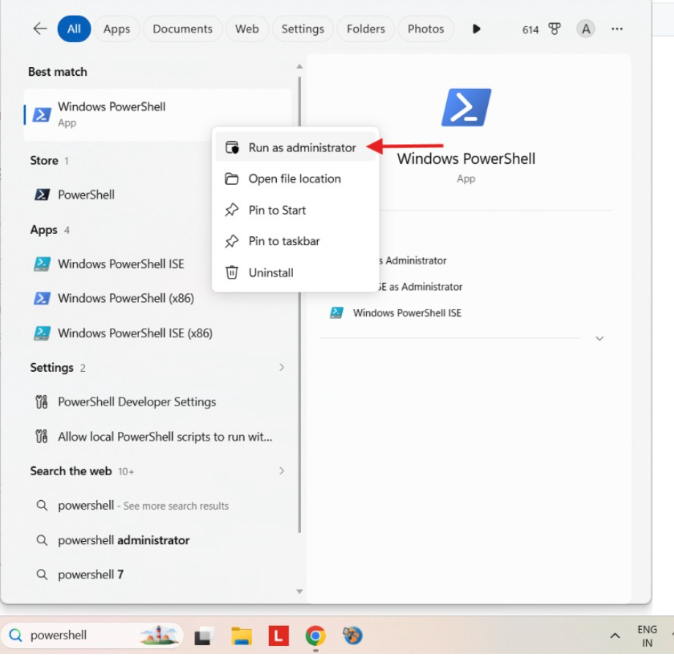

3. Click **Yes** on the User Account Control (UAC) prompt.
4. Copy and paste the following command into PowerShell and press **Enter**:
   ```powershell
   Set-ExecutionPolicy Bypass -Scope Process -Force; [System.Net.ServicePointManager]::SecurityProtocol = [System.Net.ServicePointManager]::SecurityProtocol -bor 3072; iex ((New-Object System.Net.WebClient).DownloadString('https://community.chocolatey.org/install.ps1'))
   ```
   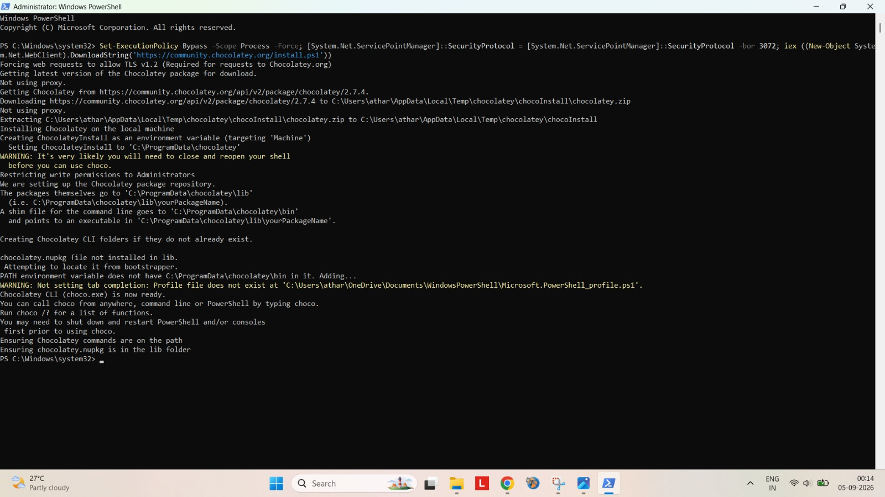

5. Wait 30–60 seconds until the installation finishes.
6. Close the PowerShell window, then open a fresh PowerShell window (as Administrator) and verify it works by typing:
   ```powershell
   choco --version
   ```
   If it prints a version number (like `2.x.x`), Chocolatey is ready!
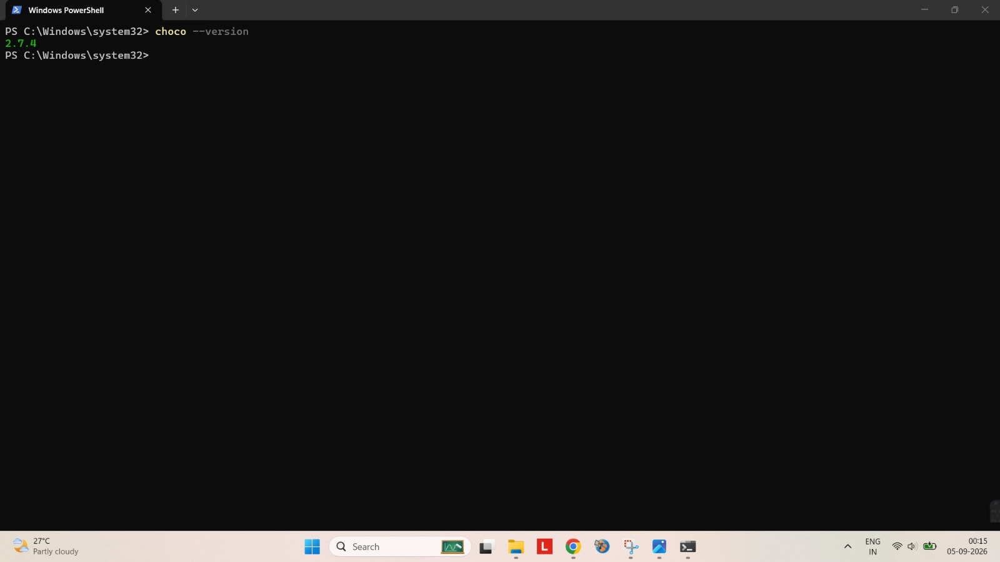


> [!NOTE]
> *Alternative*: Modern Windows 11/10 also comes with a built-in package manager called `winget`. However, Chocolatey is recommended here as it reliably configures developer PATH variables.

---

## 2.2 Install All Development Tools (One-Click)

Open **PowerShell as Administrator** and run this single command to install everything you need:

```powershell
choco install -y git vscode nodejs-lts python3 uv 7zip curl wget mingw
```

What this installs:
- `git`: Version control system.
- `vscode`: Visual Studio Code editor.
- `nodejs-lts`: Node.js (Long Term Support) & `npm` for web development.
- `python3`: Python programming language & `pip`.
- `uv`: Modern, blazing-fast Python package and project manager (replaces `pip` with 10x-100x faster installs).
- `7zip`: Compression & extraction tool.
- `curl` & `wget`: Command-line tools for downloading files and testing APIs.
- `mingw`: MinGW-w64 (includes `gcc`, `g++`, and `gdb` compilers for C and C++).

> [!NOTE]
> *Alternative standalone install for uv:* If you prefer installing `uv` standalone via PowerShell directly:
> ```powershell
> powershell -ExecutionPolicy ByPass -c "irm https://astral.sh/uv/install.ps1 | iex"
> ```

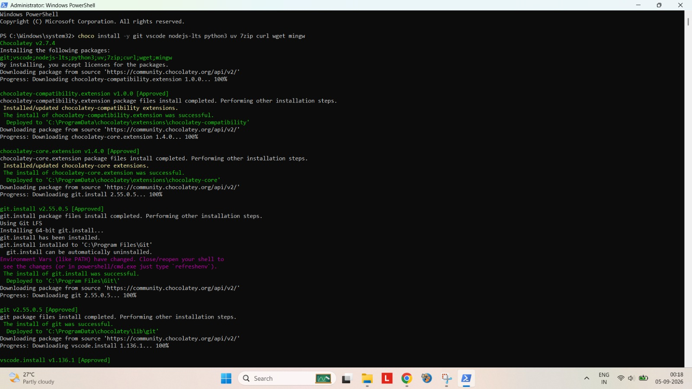

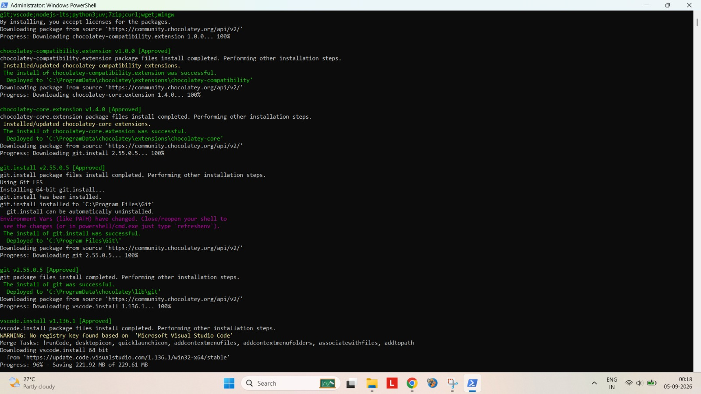


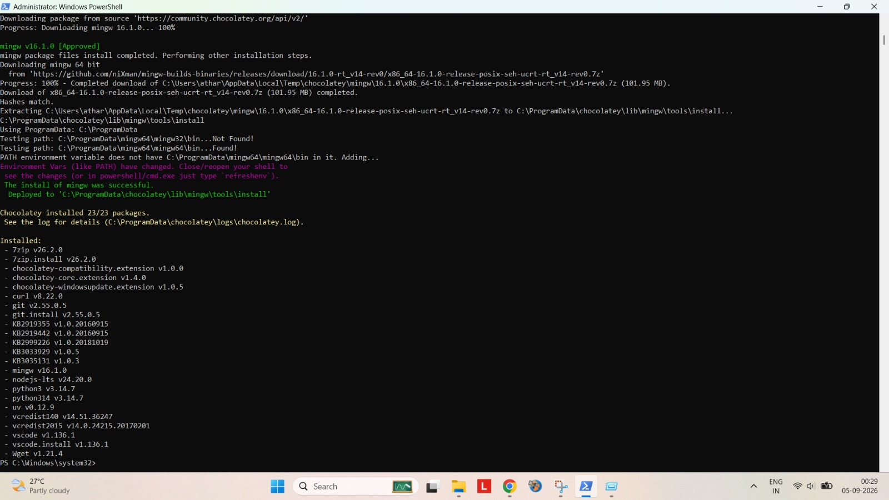

---

## 2.3 Compilers & Environment Variables (PATH)

### What is the PATH Environment Variable?
Think of your computer as a giant library. When you type `gcc` or `python` in a terminal, Windows doesn't know where those programs are stored unless you add their folder location to the **PATH**. PATH is a list of directory shortcuts that Windows checks whenever you run a command.

Chocolatey automatically sets up most paths, but you must verify that the C/C++ compiler (`gcc`/`g++`) is registered.

### Step-by-Step PATH Verification:
1. Press `Windows Key + R`, type `sysdm.cpl`, and hit **Enter** (or search **Edit the system environment variables** in the Start Menu).
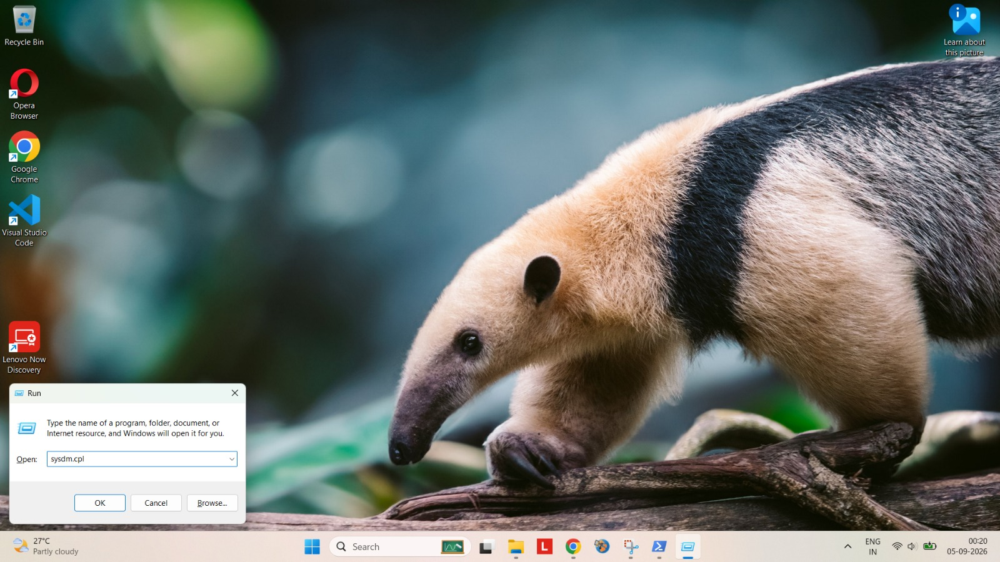

2. In the System Properties window, click on the **Advanced** tab, then click the **Environment Variables...** button at the bottom.
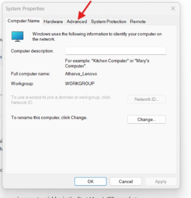

3. In the lower section called **System variables**, find the variable named **Path** and click **Edit...**.
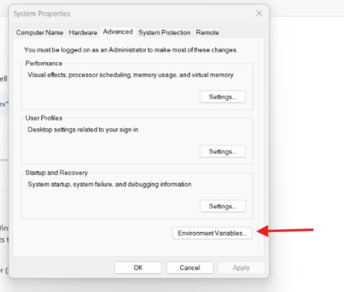

4. Check if the MinGW bin path exists in the list (usually `C:\tools\mingw64\bin` or `C:\ProgramData\chocolatey\bin`).
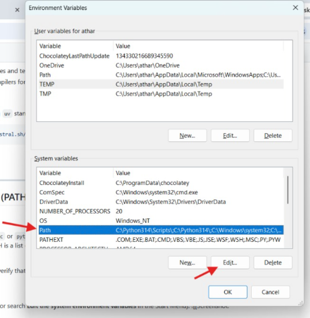

   - If it is **not** there:
     - Click **New**.
     - Paste: `C:\tools\mingw64\bin` (or the folder where MinGW's `gcc.exe` was installed).
     - Click **OK** on all windows to save.
5. **Restart your terminal / PowerShell** (environment variables only update in newly opened terminals).

### Verify Everything in a New Terminal:
Open a regular PowerShell or Command Prompt window and run:

```powershell
gcc --version
g++ --version
python --version
uv --version
node --version
git --version
```

If all of them return version numbers, your Windows development environment is completely set up!

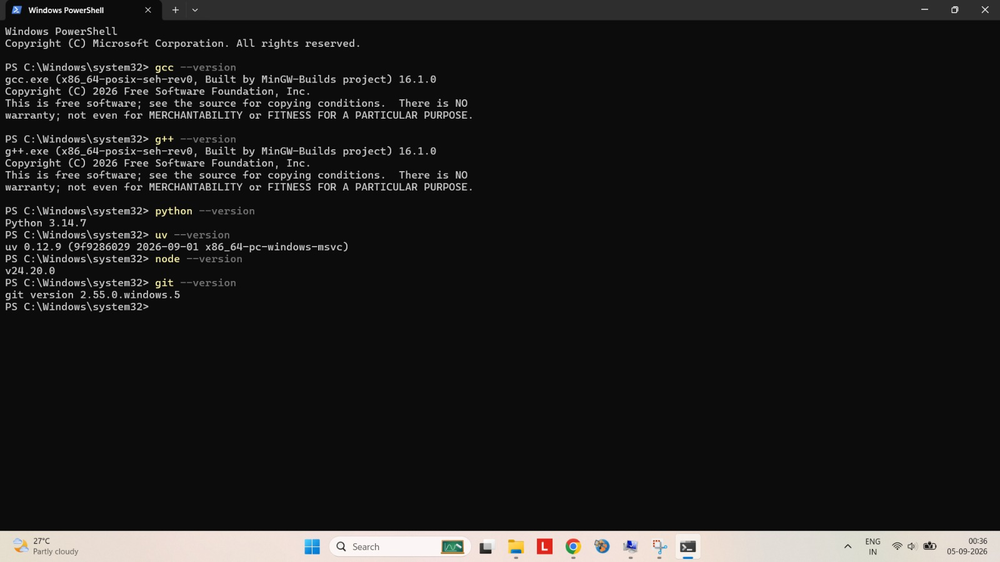

---

## 2.4 Git Setup & Authentication (Windows)

Now we will configure your identity in Git and link your computer to your GitHub account.

### Step 1: Set your Git Name and Email
Open PowerShell and run:
```powershell
git config --global user.name "Your Name"
git config --global user.email "your_email@example.com"
```
*(Make sure to use the exact same email address you used when registering on GitHub!)*

### Step 2: Authenticate with GitHub (SSH Key Method)
1. In PowerShell, generate a new secure SSH key:
   ```powershell
   ssh-keygen -t ed25519 -C "your_email@example.com"
   ```
2. Press **Enter** to accept the default file location.
3. Press **Enter** twice when asked for a passphrase (or enter a passphrase if you want extra security).
4. Copy your public key to the clipboard:
   ```powershell
   Get-Content ~/.ssh/id_ed25519.pub | Set-Clipboard
   ```
5. Go to GitHub:
   - Click your profile photo in the top right -> **Settings**.
   - On the left sidebar, click **SSH and GPG keys**.
   - Click the green **New SSH key** button.
   - Set Title: `My Windows Laptop`.
   - Key type: `Authentication Key`.
   - Paste your key into the **Key** box.
   - Click **Add SSH key**.
6. Test your connection in PowerShell:
   ```powershell
   ssh -T git@github.com
   ```
   If prompted *"Are you sure you want to continue connecting (yes/no/[fingerprint])?"*, type `yes` and hit Enter.
   You will see: `Hi <username>! You've successfully authenticated...`

Git is now 100% installed, configured, and authenticated on your Windows PC!

---

## Next Steps

- Proceed to the **[5. Quick Verification Checklist](checklist.md)** to verify your setup.
- Or return to the **[Basic Installation Overview](README.md)**.
