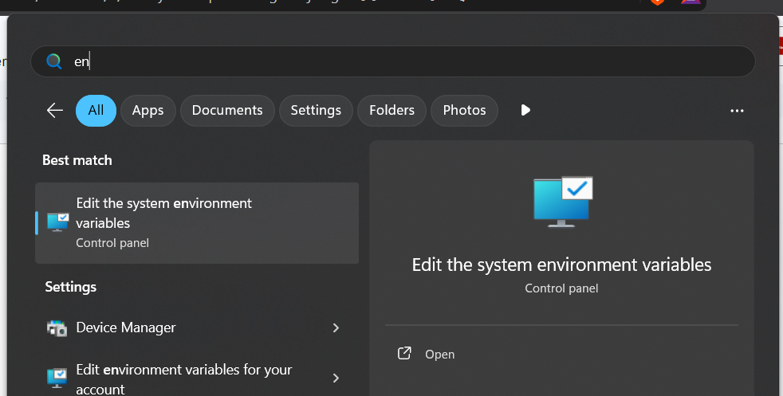
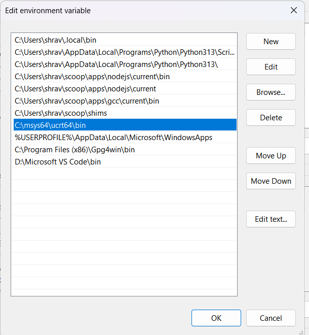
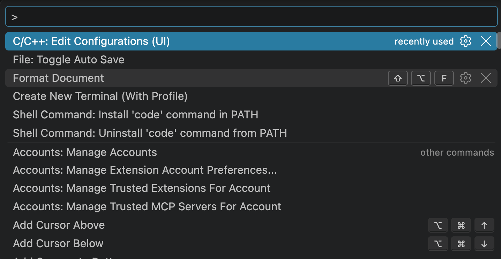
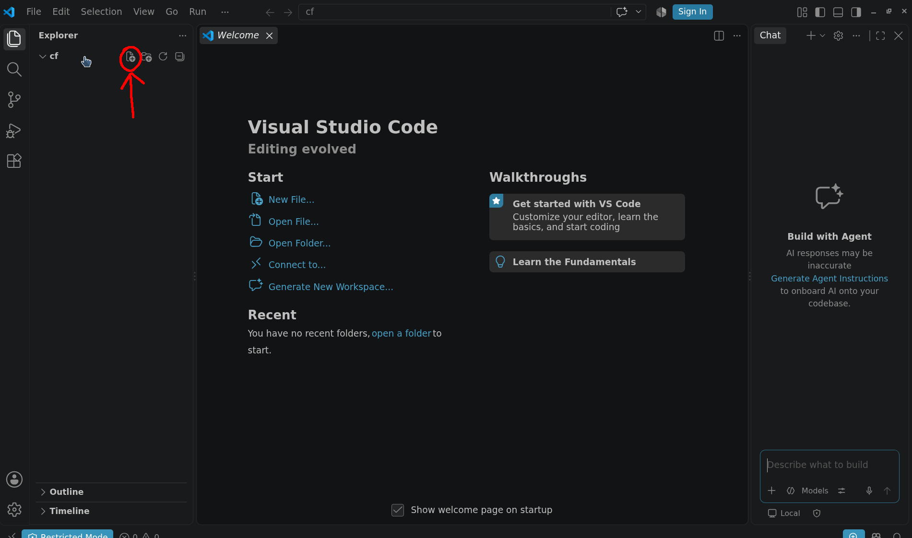
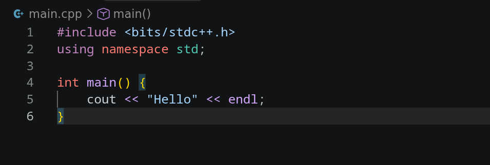
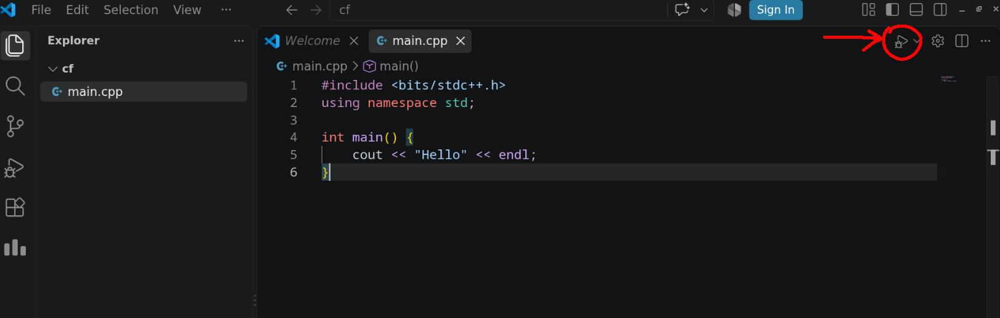
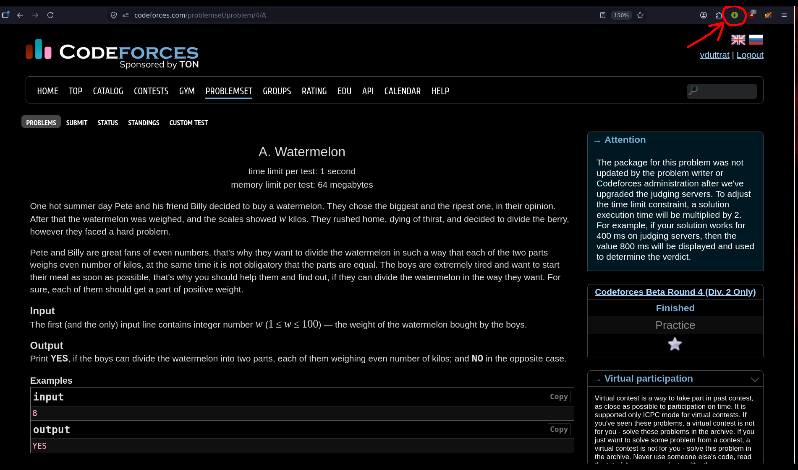
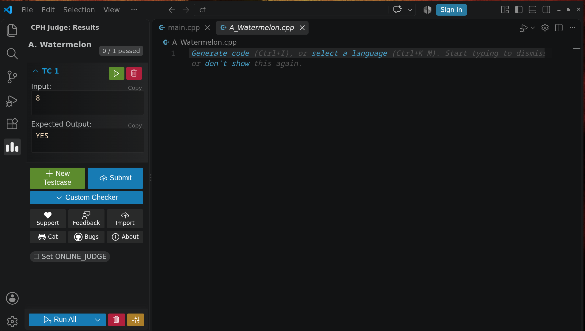
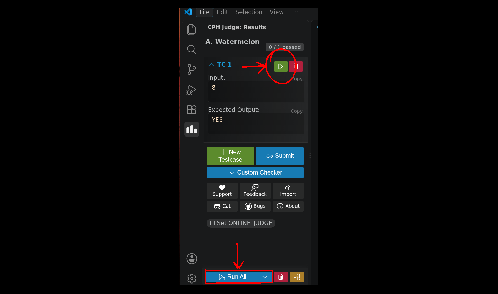
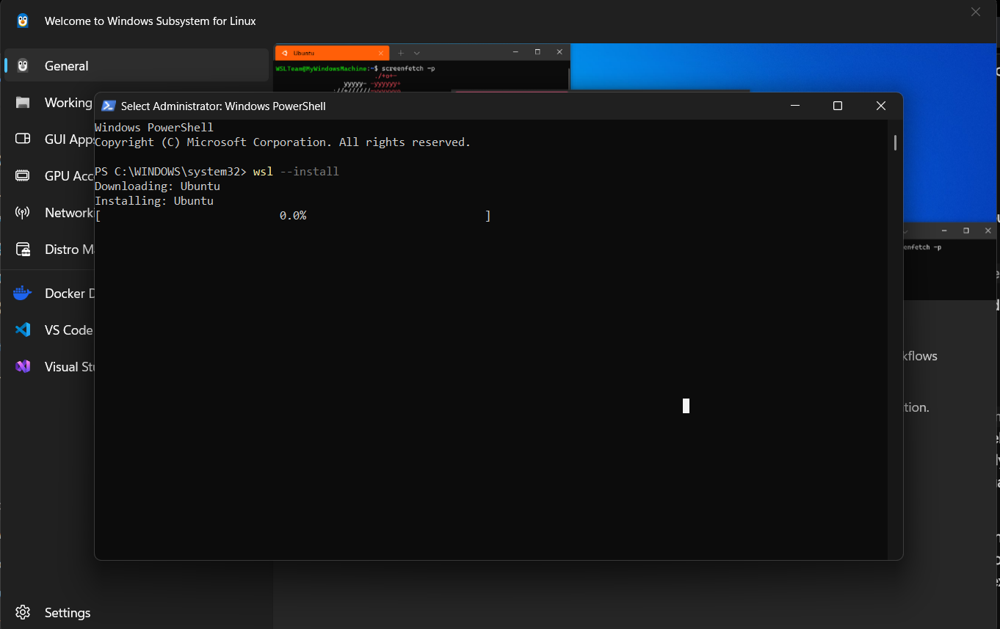

# 2. Windows Setup Guide

For Windows, we will use **Chocolatey**, the most popular package manager for Windows. Instead of manually downloading 10 different `.exe` installers from random websites and clicking "Next-Next-Finish", Chocolatey installs everything safely via a single command!

---

## 📑 Table of Contents

- [2.1 Install Package Manager: Chocolatey](#21-install-package-manager-chocolatey)
- [2.2 Install All Development Tools (One-Click)](#22-install-all-development-tools-one-click)
- [2.3 Compilers & Environment Variables (PATH)](#23-compilers--environment-variables-path)
  - [Install the Modern GCC Compiler (MSYS2 UCRT64)](#install-the-modern-gcc-compiler-msys2-ucrt64)
  - [What is the PATH Environment Variable?](#what-is-the-path-environment-variable)
  - [Step-by-Step PATH Verification](#step-by-step-path-verification)
  - [Verify Everything in a New Terminal](#verify-everything-in-a-new-terminal)
- [2.4 Configure VS Code for C/C++ & Competitive Programming](#24-configure-vs-code-for-cc--competitive-programming)
- [2.5 Running Your First C++ File in VS Code](#25-running-your-first-c-file-in-vs-code)
  - [Step 1: Open Your Working Directory](#step-1-open-your-working-directory)
  - [Step 2: Create a C++ Source File](#step-2-create-a-c-source-file)
  - [Step 3: Write and Run Your Code](#step-3-write-and-run-your-code)
- [2.6 Using Competitive Companion & CPH in VS Code](#26-using-competitive-companion--cph-in-vs-code)
- [2.7 Verifying Advanced CP Features (PBDS ordered_set)](#27-verifying-advanced-cp-features-pbds-ordered_set)
- [2.8 Git Setup & Authentication (Windows)](#28-git-setup--authentication-windows)
  - [Step 1: Set your Git Name and Email](#step-1-set-your-git-name-and-email)
  - [Step 2: Authenticate with GitHub via SSH](#step-2-authenticate-with-github-via-ssh)
- [2.9 Windows Subsystem for Linux (WSL)](#29-windows-subsystem-for-linux-wsl)
  - [Step 1: Install WSL and Ubuntu](#step-1-install-wsl-and-ubuntu)
  - [Step 2: Configure your Linux Profile](#step-2-configure-your-linux-profile)
  - [Step 3: Update Linux and Install Essential & CTF Tools](#step-3-update-linux-and-install-essential--ctf-tools)
  - [Step 4: Web3 & Solana Development Setup (inside WSL)](#step-4-web3--solana-development-setup-inside-wsl)
- [Next Steps](#next-steps)

---

## 2.1 Install Package Manager: Chocolatey

1. Press the **Windows Key** on your keyboard, type **PowerShell**.
2. **Right-click** on **Windows PowerShell** and select **Run as Administrator**.
   
3. Click **Yes** on the User Account Control (UAC) prompt.
4. Copy and paste the following command into PowerShell and press **Enter**:
   ```powershell
   Set-ExecutionPolicy Bypass -Scope Process -Force; [System.Net.ServicePointManager]::SecurityProtocol = [System.Net.ServicePointManager]::SecurityProtocol -bor 3072; iex ((New-Object System.Net.WebClient).DownloadString('https://community.chocolatey.org/install.ps1'))
   ```
   
5. Wait 30–60 seconds until the installation finishes.
6. Close the PowerShell window, then open a fresh PowerShell window (as Administrator) and verify it works by typing:
   ```powershell
   choco --version
   ```
   If it prints a version number (like `2.x.x`), Chocolatey is ready!
   

> [!NOTE]
> *Alternative*: Modern Windows 11/10 also comes with a built-in package manager called `winget`. However, Chocolatey is recommended here as it reliably configures developer PATH variables.

---

## 2.2 Install All Development Tools (One-Click)

Open **PowerShell as Administrator** and run this single command to install everything you need:

```powershell
choco install -y git vscode nodejs-lts python3 uv 7zip curl wget
choco install -y msys2 --params "/InstallDir:C:\msys64"
```

What this installs:
- `git`: Version control system.
- `vscode`: Visual Studio Code editor.
- `nodejs-lts`: Node.js (Long Term Support) & `npm` for web development.
- `python3`: Python programming language & `pip`.
- `uv`: Modern, blazing-fast Python package and project manager (replaces `pip` with 10x-100x faster installs).
- `7zip`: Compression & extraction tool.
- `curl` & `wget`: Command-line tools for downloading files and testing APIs.
- `msys2`: MSYS2 development platform (provides the modern GNU GCC compiler toolchain without legacy MinGW bugs).

> [!TIP]
> **Using winget instead?**
> If you prefer Windows built-in `winget` (as in the official CP Wing guide), run:
> ```powershell
> winget install MSYS2.MSYS2
> ```
> Winget automatically installs MSYS2 directly to `C:\msys64`.
> *(Note: If you previously installed MSYS2 via plain Chocolatey without parameters, it may be installed at `C:\tools\msys64` instead; simply use `C:\tools\msys64` wherever `C:\msys64` appears below).*

---

## 2.3 Compilers & Environment Variables (PATH)

### Install the Modern GCC Compiler (MSYS2 UCRT64)

> [!IMPORTANT]
> **Why MSYS2 UCRT64 instead of legacy MinGW?**
> Legacy MinGW distributions (such as older MinGW-w64 packages) suffer from an infamous bug with Policy-Based Data Structures (PBDS) — specifically breaking `ordered_set` (`<ext/pb_ds/assoc_container.hpp>`) due to a corrupted internal header filename in the package.
> MSYS2 UCRT64 provides the modern, upstream GNU GCC compiler toolchain (GCC 14+) built on the modern Windows Universal C Runtime (UCRT). With MSYS2, `<bits/stdc++.h>`, `ordered_set`, and modern C++20/C++23 features work flawlessly out of the box!

To install the standard GNU GCC C/C++ compiler, debugger, and build utilities:

1. In your Administrator PowerShell, run:
   ```powershell
   C:\msys64\usr\bin\bash.exe -lc "pacman -S --noconfirm mingw-w64-ucrt-x86_64-toolchain"
   ```
   *(Alternatively, launch **MSYS2 UCRT64** from the Windows Start Menu and run `pacman -S --noconfirm mingw-w64-ucrt-x86_64-toolchain`).*

---

### What is the PATH Environment Variable?
Think of your computer as a giant library. When you type `gcc` or `python` in a terminal, Windows doesn't know where those programs are stored unless you add their folder location to the **PATH**. PATH is a list of directory shortcuts that Windows checks whenever you run a command.

To make `gcc`, `g++`, and `gdb` accessible from PowerShell, Command Prompt, and VS Code, we add the MSYS2 UCRT64 `bin` folder to PATH.

### Step-by-Step PATH Verification:
1. Search **Environment Variables** in the Start Menu and select **Edit the system environment variables** (or press `Windows Key + R`, type `sysdm.cpl`, and hit Enter).
   
   

2. In the System Properties window, click on the **Advanced** tab, then click the **Environment Variables...** button at the bottom.
   

3. Under **User variables** (or **System variables**), find the variable named **Path** and click **Edit...**.
   

4. Add the MSYS2 UCRT64 compiler path:
   - Click **New**.
   - Paste: `C:\msys64\ucrt64\bin`
   - **Click "Move Up" until `C:\msys64\ucrt64\bin` is at the very top of the list!**
   - Click **OK** on all dialog windows to save.
   
   

   > [!IMPORTANT]
   > **Keep MSYS2 at the Top of PATH:**
   > In other setups, if any other compiler paths exist (such as legacy `C:\tools\mingw64\bin`), make sure they are strictly **below** `C:\msys64\ucrt64\bin` (or delete them). This guarantees that older MinGW compilers never shadow your modern MSYS2 GCC compiler.

5. **Restart your terminal / PowerShell and VS Code** (environment variables only update in newly opened processes).

### Verify Everything in a New Terminal:
Open a regular PowerShell or Command Prompt window and run:

```powershell
gcc --version
g++ --version
python --version
uv --version
node --version
git --version
```

If all of them return version numbers, your Windows development environment is completely set up!


---

## 2.4 Configure VS Code for C/C++ & Competitive Programming

Now configure VS Code so IntelliSense and syntax diagnostics use your newly installed MSYS2 compiler:

1. Open VS Code.
2. Press `Ctrl + Shift + P` to open the Command Palette.
3. Type and select: **`C/C++: Edit Configurations (UI)`**.
4. Set the following options:
   - **Compiler Path:** `C:\msys64\ucrt64\bin\g++.exe`
   - **IntelliSense Mode:** `gcc-x64`
   - **C++ Standard:** `c++17` (or `c++20`)
5. *(Recommended Tip)*: Press `Ctrl + Shift + P` -> search `File: Toggle Auto Save` -> click it to turn on auto-save so your files are always automatically saved before compilation!



### Configure Code Runner & CPH for Windows:
1. **Code Runner Settings**:
   - Open Settings (`Ctrl + ,`).
   - Search for `run in terminal` -> check **Code-runner: Run In Terminal**.
   - Search for `save file before run` -> check **Code-runner: Save File Before Run**.
   - Search for `executor map` -> click **Edit in settings.json** and ensure `"cpp"` compiles with optimization and PowerShell compatibility:
     ```json
     "cpp": "cd $dir && g++ -std=c++17 -O2 $fileName -o $fileNameWithoutExt.exe && & .\\$fileNameWithoutExt.exe",
     "c": "cd $dir && gcc $fileName -o $fileNameWithoutExt.exe && & .\\$fileNameWithoutExt.exe"
     ```
2. **CPH (Competitive Programming Helper) Settings**:
   - In Settings, search for `CPH Language Cpp`.
   - Set **CPH > Language: Cpp > Command**: `g++` (or `C:\msys64\ucrt64\bin\g++.exe`).
   - Set **CPH > Language: Cpp > Args**: `-std=c++17 -O2`.

---

## 2.5 Running Your First C++ File in VS Code

Follow the official CP Wing workflow to set up your project workspace and run your first C++ program on Windows:

### Step 1: Open Your Working Directory
Press `Ctrl + K` then `Ctrl + O` (or click **File** -> **Open Folder...**) to open the file browser. Create or select a dedicated folder where you will write your code (e.g. `C:\Users\<username>\cp` or `C:\coding`):



### Step 2: Create a C++ Source File
In the Explorer sidebar, click the **New File** icon (or press `Ctrl + N`), name the file `main.cpp`, and hit **Enter**:



### Step 3: Write and Run Your Code
Paste a basic C++ test snippet into `main.cpp`:

```cpp
#include <bits/stdc++.h>
using namespace std;

int main() {
    int a, b;
    cout << "Enter two numbers: ";
    cin >> a >> b;
    cout << "Sum: " << a + b << '\n';
    return 0;
}
```

**Two ways to run your code on Windows:**

1. **Via the Play Button (Code Runner / C++ Extension):**
   Click the **Play / Run Code** button in the top-right corner of the editor window:

   

   *(Ensure you enabled `Code-runner: Run In Terminal` in VS Code settings as described in [1.8 VS Code Extensions](universal.md#18-essential-vs-code-extensions) so the program accepts interactive keyboard input like `cin`).*

2. **Via the Integrated Terminal (`Ctrl + ~`):**
   Open the terminal inside VS Code and compile with your MSYS2 GCC compiler:
   ```powershell
   g++ -std=c++17 -O2 main.cpp -o main.exe
   .\main.exe
   ```
   Enter `5 7` and press Enter. The output will display:
   ```text
   Sum: 12
   ```

---

## 2.6 Using Competitive Companion & CPH in VS Code

The official CP Wing workflow connects your browser directly to VS Code for one-click problem parsing and automated judging:

1. **Browser & Extension Setup:**
   Confirm you have installed **Competitive Companion** in Chrome, Edge, or Brave and **Competitive Programming Helper (cph)** in VS Code (see [1.7 Browser Extensions](universal.md#17-recommended-browser-extensions) and [1.8 VS Code Extensions](universal.md#18-essential-vs-code-extensions)).

2. **Parse Any Contest Problem:**
   Open any problem on Codeforces, CodeChef, or AtCoder in your browser. Click the green **`+` (Competitive Companion)** icon in the browser toolbar:

   

3. **Automatic Problem Generation:**
   Switch to VS Code. If prompted to select a language, select `cpp`. CPH will automatically create the source file and load all sample test cases side-by-side:

   

4. **Run and Verify Testcases:**
   Write your solution and click the **Run** button next to each testcase (or click **Run All**):

   

   - 🟩 **Passed**: Expected output matches your program's output.
   - 🟥 **Failed**: Shows an exact side-by-side diff between expected and actual output.

---

## 2.7 Verifying Advanced CP Features (PBDS ordered_set)

In modern competitive programming, specialized GNU extensions like **Policy-Based Data Structures (PBDS)** (`ordered_set`) and compiler optimization pragmas are frequently used. Verify that your MSYS2 compiler supports them without legacy MinGW bugs:

Create a file named `test_pbds.cpp`:

```cpp
#include <bits/stdc++.h>
#include <ext/pb_ds/assoc_container.hpp>
#include <ext/pb_ds/tree_policy.hpp>

// Compiler optimization pragmas
#pragma GCC optimize("O3")
#pragma GCC optimize("unroll-loops")

// x86_64 architecture target optimizations
#if (defined(__x86_64__) || defined(_M_X64)) && !defined(__APPLE__)
#pragma GCC target("avx2,bmi,bmi2,lzcnt,popcnt")
#endif

using namespace std;
using namespace __gnu_pbds;

// Definition of ordered_set (Policy-Based Data Structure)
template<class T>
using ordered_set = tree<T, null_type, less<T>, rb_tree_tag, tree_order_statistics_node_update>;

template<class T>
using ordered_multiset = tree<T, null_type, less_equal<T>, rb_tree_tag, tree_order_statistics_node_update>;

int main() {
    // Fast I/O
    ios_base::sync_with_stdio(false);
    cin.tie(NULL);

    ordered_set<int> s;
    s.insert(10);
    s.insert(20);
    s.insert(30);

    // find_by_order(k): returns iterator to the k-th smallest element (0-indexed)
    cout << "Element at index 1: " << *s.find_by_order(1) << " (Expected: 20)" << '\n';

    // order_of_key(k): returns count of elements strictly smaller than k
    cout << "Elements < 25: " << s.order_of_key(25) << " (Expected: 2)" << '\n';

    cout << "Windows MSYS2 UCRT64 GCC, PBDS, and optimization pragmas are 100% operational!" << '\n';
    return 0;
}
```

In your VS Code terminal, compile and run:
```powershell
g++ -std=c++17 -O2 test_pbds.cpp -o test_pbds.exe
.\test_pbds.exe
```

Expected output:
```text
Element at index 1: 20 (Expected: 20)
Elements < 25: 2 (Expected: 2)
Windows MSYS2 UCRT64 GCC, PBDS, and optimization pragmas are 100% operational!
```

---

## 2.8 Git Setup & Authentication (Windows)

Now we will configure your identity in Git and link your computer to your GitHub account.

### Step 1: Set your Git Name and Email
Open PowerShell and run:
```powershell
git config --global user.name "Your Name"
git config --global user.email "your_email@example.com"
```
*(Make sure to use the exact same email address you used when registering on GitHub!)*

### Step 2: Authenticate with GitHub via SSH
1. In PowerShell, generate a new secure SSH key:
   ```powershell
   ssh-keygen -t ed25519 -C "your_email@example.com"
   ```
2. Press **Enter** to accept the default file location.
3. Press **Enter** twice when asked for a passphrase (or enter a passphrase if you want extra security).
4. Copy your public key to the clipboard:
   ```powershell
   Get-Content ~/.ssh/id_ed25519.pub | Set-Clipboard
   ```
5. Go to GitHub:
   - Click your profile photo in the top right -> **Settings**.
   - On the left sidebar, click **SSH and GPG keys**.
   - Click the green **New SSH key** button.
   - Set Title: `My Windows Laptop`.
   - Key type: `Authentication Key`.
   - Paste your key into the **Key** box.
   - Click **Add SSH key**.
6. Test your connection in PowerShell:
   ```powershell
   ssh -T git@github.com
   ```
   If prompted *"Are you sure you want to continue connecting (yes/no/[fingerprint])?"*, type `yes` and hit Enter.
   You will see: `Hi <username>! You've successfully authenticated...`

Git is now 100% installed, configured, and authenticated on your Windows PC!

---

## 2.9 Windows Subsystem for Linux (WSL)

Many standard developer and cybersecurity tools are designed natively for Linux. Instead of setting up a complex dual-boot system, Windows allows you to run a full Ubuntu Linux environment directly inside Windows using WSL.

> [!TIP]
> **WSL as a Pure Linux Compiler Environment:**
> In addition to native Windows MSYS2 GCC, WSL provides a 100% native Linux GNU GCC compiler environment (`sudo apt install build-essential`), exactly identical to online contest platforms (Codeforces, CodeChef, AtCoder, CSES). You can compile and test your CP code inside WSL anytime!

### Step 1: Install WSL and Ubuntu
1. Open **PowerShell as Administrator** (Right-click Windows Start -> Terminal/PowerShell (Admin)).
2. Run the following command: 
   ```powershell
   wsl --install
   ```
   This command automatically enables the required virtualization features and downloads Ubuntu as the default distribution.
3. Wait for the download to finish. Restart your computer if prompted.



### Step 2: Configure your Linux Profile
1. After your computer restarts, a new terminal window will automatically launch saying *"Installing, this may take a few minutes..."*
2. When prompted, create a **UNIX username**. Type a simple username (all lowercase, no spaces) and hit **Enter**.
3. Create a **password**:
   > [!NOTE]
   > When typing your password in a Linux terminal, **no characters or asterisks will appear on screen**. This is standard Unix security behavior. Just type it carefully and press Enter, then retype it to confirm.
4. Run `wsl --status` to verify that WSL 2 is successfully installed and running.

> [!TIP]
> **How to launch WSL in the future:**
> - Launch **Ubuntu** directly from your Start Menu, OR
> - Open Windows Terminal / PowerShell and type `wsl`.

### Step 3: Update Linux and Install Essential & CTF Tools

Inside your Ubuntu Terminal, run:

1. Update package lists and upgrade existing packages:
   ```bash
   sudo apt update && sudo apt upgrade -y
   ```
2. Install C/C++ build tools, Node.js, and essential CTF / Cybersecurity utilities:
   ```bash
   sudo apt install -y build-essential libimage-exiftool-perl nmap netcat-traditional binwalk steghide nodejs npm pkg-config libssl-dev libudev-dev
   ```

### Step 4: Web3 & Solana Development Setup (inside WSL)

> [!IMPORTANT]
> **Why install Solana & Anchor inside WSL?**
> Solana smart contracts are written in Rust, and the Anchor framework is built for Unix/Linux environments. Installing or compiling them natively on Windows PowerShell/CMD often results in broken compilation scripts and linker errors. Running everything inside **WSL (Ubuntu)** gives you a stable, native Linux environment.

Inside your Ubuntu Terminal, run:

1. **Install Rust (Rustup Toolchain):**
   ```bash
   curl --proto '=https' --tlsv1.2 -sSf https://sh.rustup.rs | sh
   ```
   When prompted, press `1` and hit Enter (default install). Once complete, reload your shell:
   ```bash
   source $HOME/.cargo/env
   ```
   Verify Rust compiler and package manager:
   ```bash
   rustc --version
   cargo --version
   ```

2. **Install Solana CLI:**
   ```bash
   sh -c "$(curl -sSfL https://release.anza.xyz/stable/install)"
   ```
   Add Solana CLI to your PATH permanently:
   ```bash
   echo 'export PATH="$HOME/.local/share/solana/install/active_release/bin:$PATH"' >> ~/.bashrc
   source ~/.bashrc
   ```
   Verify Solana CLI:
   ```bash
   solana --version
   ```
   Configure default cluster to devnet and generate your local keypair:
   ```bash
   solana config set --url devnet
   solana-keygen new
   solana address
   ```
   *(Save the printed recovery seed phrase somewhere safe offline!)*

3. **Install Anchor Version Manager (AVM):**
   ```bash
   cargo install --git https://github.com/coral-xyz/anchor avm --locked --force
   ```
   *(☕ Note: This step compiles from source and takes 5–10 minutes. Let it run to completion).*
   Verify:
   ```bash
   avm --version
   ```

4. **Install Anchor Framework CLI:**
   ```bash
   avm install latest
   avm use latest
   ```
   Verify:
   ```bash
   anchor --version
   ```

5. **Smoke-Test Your Full Solana Environment:**
   ```bash
   anchor init my-first-project
   cd my-first-project
   anchor build
   ```
   If `anchor build` finishes without errors, your Solana dev environment is 100% operational! 🎉

---

## Next Steps

- Now that VS Code, compilers, Git, and WSL are installed, head over to **[1.8 Essential VS Code Extensions](universal.md#18-essential-vs-code-extensions)** to install the recommended extensions (C/C++, CPH, Code Runner, Python, Jupyter, Ruff, etc.).
- After installing extensions, proceed to the **[5. Quick Verification Checklist](checklist.md)** to verify your complete setup.
- Or return to the **[Basic Installation Overview](README.md)**.
